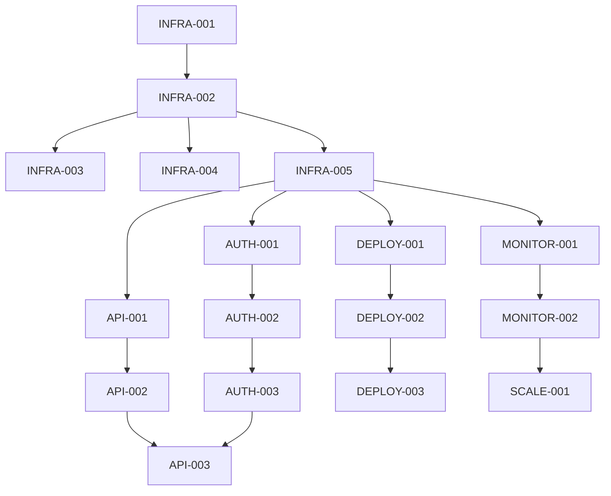

# Capsule Platform - Task Breakdown

## Visão Geral

Este documento contém o breakdown completo de tarefas para implementar a plataforma Capsule, organizado por microserviços, com estimativas de complexidade, dependências e roadmap baseado nas 3 fases descritas no PRD.

## Legendas e Classificações

### Prioridades
- **P0**: Crítico - Bloqueador para outras tarefas
- **P1**: Alta - Essencial para MVP
- **P2**: Média - Importante mas não bloqueador
- **P3**: Baixa - Nice to have

### Story Points
- **1**: Trivial (< 4 horas)
- **2**: Pequena (4-8 horas)
- **3**: Média (1-2 dias)
- **5**: Grande (2-3 dias)
- **8**: Muito Grande (3-5 dias)

### Status
- 🔴 Não iniciado
- 🟡 Em progresso
- 🟢 Concluído
- ⏸️ Bloqueado

---

## FASE 1: MVP Foundation (Q1 2025)

### Sprint 1-2: Core Infrastructure

#### INFRA-001: Setup Nx Monorepo Structure
**Status**: 🟢 Concluído  
**Microserviço**: Infrastructure  
**Prioridade**: P0  
**Story Points**: 3  
**Dependências**: Nenhuma  

**Descrição**: Configurar estrutura base do monorepo Nx com workspaces para apps e libs.

**Critérios de Aceitação**:
- [x] nx.json configurado
- [x] tsconfig.base.json configurado
- [x] Estrutura de pastas apps/ e libs/ criada
- [x] Scripts npm básicos configurados

---

#### INFRA-002: Docker e Docker Compose Setup
**Status**: 🔴 Não iniciado  
**Microserviço**: Infrastructure  
**Prioridade**: P0  
**Story Points**: 3  
**Dependências**: INFRA-001  

**Descrição**: Criar configuração Docker para todos os serviços e docker-compose para desenvolvimento local.

**Critérios de Aceitação**:
- [ ] Dockerfile para cada microserviço
- [ ] docker-compose.yml com todos os serviços
- [ ] Scripts para build e deploy local
- [ ] Documentação de uso

**Tarefas**:
```yaml
- Criar Dockerfile.base com imagem Node.js 20
- Criar Dockerfile para api-gateway
- Criar Dockerfile para auth-service
- Configurar docker-compose com rede interna
- Adicionar volumes para hot-reload em desenvolvimento
```

---

#### INFRA-003: PostgreSQL Database Setup
**Status**: 🔴 Não iniciado  
**Microserviço**: Infrastructure  
**Prioridade**: P0  
**Story Points**: 2  
**Dependências**: INFRA-002  

**Descrição**: Configurar PostgreSQL 15 com schemas iniciais e migrations.

**Critérios de Aceitação**:
- [ ] PostgreSQL no docker-compose
- [ ] Schema inicial criado
- [ ] Sistema de migrations configurado
- [ ] Connection pooling configurado

**Tarefas**:
```yaml
- Adicionar PostgreSQL 15 ao docker-compose
- Criar schema inicial (organizations, projects, users)
- Configurar TypeORM com NestJS
- Implementar migrations automáticas
- Configurar pgBouncer para connection pooling
```

---

#### INFRA-004: Redis Cache Setup
**Status**: 🔴 Não iniciado  
**Microserviço**: Infrastructure  
**Prioridade**: P1  
**Story Points**: 2  
**Dependências**: INFRA-002  

**Descrição**: Configurar Redis 7 para cache e session storage.

**Critérios de Aceitação**:
- [ ] Redis no docker-compose
- [ ] Cliente Redis configurado
- [ ] Cache module implementado
- [ ] Session storage configurado

---

#### INFRA-005: RabbitMQ Message Queue Setup
**Status**: 🔴 Não iniciado  
**Microserviço**: Infrastructure  
**Prioridade**: P0  
**Story Points**: 3  
**Dependências**: INFRA-002  

**Descrição**: Configurar RabbitMQ para comunicação entre microserviços.

**Critérios de Aceitação**:
- [ ] RabbitMQ no docker-compose
- [ ] Exchanges e queues configuradas
- [ ] Dead letter queue implementada
- [ ] Management UI habilitada

**Tarefas**:
```yaml
- Adicionar RabbitMQ 3.13 ao docker-compose
- Criar exchange 'capsule.events' (topic)
- Criar exchange 'capsule.commands' (direct)
- Configurar queues para cada serviço
- Implementar retry policy e DLQ
```

---

#### API-001: API Gateway Base Implementation
**Status**: 🟡 Em progresso  
**Microserviço**: api-gateway  
**Prioridade**: P0  
**Story Points**: 5  
**Dependências**: INFRA-005  

**Descrição**: Implementar API Gateway com NestJS incluindo roteamento e documentação.

**Critérios de Aceitação**:
- [x] Estrutura base NestJS criada
- [ ] Swagger/OpenAPI configurado
- [ ] Rate limiting implementado
- [ ] CORS configurado
- [ ] Health check endpoint

**Tarefas**:
```yaml
- Configurar Swagger com DocumentBuilder
- Implementar rate limiting com throttler
- Configurar CORS para múltiplas origens
- Criar endpoint /health
- Implementar logging interceptor
```

---

#### API-002: Request Routing to Microservices
**Status**: 🔴 Não iniciado  
**Microserviço**: api-gateway  
**Prioridade**: P0  
**Story Points**: 5  
**Dependências**: API-001, INFRA-005  

**Descrição**: Implementar roteamento de requisições do gateway para microserviços via RabbitMQ.

**Critérios de Aceitação**:
- [ ] Cliente RabbitMQ configurado
- [ ] Pattern de request/response implementado
- [ ] Timeout handling
- [ ] Error handling e retry

---

#### AUTH-001: Authentication Service Base
**Status**: 🔴 Não iniciado  
**Microserviço**: auth-service  
**Prioridade**: P0  
**Story Points**: 5  
**Dependências**: INFRA-005  

**Descrição**: Criar serviço de autenticação com comunicação via RabbitMQ.

**Critérios de Aceitação**:
- [ ] Microserviço NestJS configurado
- [ ] Comunicação RabbitMQ estabelecida
- [ ] JWT service implementado
- [ ] User validation básica

**Tarefas**:
```yaml
- Criar microserviço com Transport.RMQ
- Implementar MessagePattern handlers
- Configurar JwtModule com secret
- Implementar generateTokens method
- Criar validateToken method
```

---

#### AUTH-002: User Registration and Login
**Status**: 🔴 Não iniciado  
**Microserviço**: auth-service  
**Prioridade**: P0  
**Story Points**: 5  
**Dependências**: AUTH-001, INFRA-003  

**Descrição**: Implementar registro de usuários e login com JWT.

**Critérios de Aceitação**:
- [ ] Endpoint de registro funcional
- [ ] Endpoint de login funcional
- [ ] Password hashing com bcrypt
- [ ] Token refresh implementado

---

#### AUTH-003: JWT Token Validation
**Status**: 🔴 Não iniciado  
**Microserviço**: auth-service  
**Prioridade**: P0  
**Story Points**: 3  
**Dependências**: AUTH-002  

**Descrição**: Implementar validação de tokens JWT para rotas protegidas.

**Critérios de Aceitação**:
- [ ] Guard de autenticação criado
- [ ] Validação de token expirado
- [ ] Refresh token flow
- [ ] Blacklist de tokens

---

### Sprint 3-4: Basic Deployment

#### DEPLOY-001: Deployment Service Creation
**Status**: 🔴 Não iniciado  
**Microserviço**: service-deploy  
**Prioridade**: P0  
**Story Points**: 5  
**Dependências**: INFRA-005  

**Descrição**: Criar microserviço de deployment com comunicação RabbitMQ.

**Critérios de Aceitação**:
- [ ] Estrutura do microserviço criada
- [ ] Comunicação RabbitMQ configurada
- [ ] Deployment controller básico
- [ ] Deployment service básico

**Tarefas**:
```yaml
- Gerar novo app service-deploy com Nx
- Configurar como microserviço RabbitMQ
- Criar DeploymentController com MessagePatterns
- Implementar DeploymentService básico
- Criar DTOs para deployment requests
```

---

#### DEPLOY-002: Kubernetes Client Integration
**Status**: 🔴 Não iniciado  
**Microserviço**: service-deploy  
**Prioridade**: P0  
**Story Points**: 5  
**Dependências**: DEPLOY-001  

**Descrição**: Integrar cliente Kubernetes para gerenciar deployments.

**Critérios de Aceitação**:
- [ ] Cliente k8s configurado
- [ ] Autenticação com cluster
- [ ] CRUD de deployments
- [ ] CRUD de services

**Tarefas**:
```yaml
- Instalar @kubernetes/client-node
- Configurar KubeConfig
- Implementar createDeployment method
- Implementar updateDeployment method
- Implementar deleteDeployment method
- Criar service e ingress management
```

---

#### DEPLOY-003: Container Image Building
**Status**: 🔴 Não iniciado  
**Microserviço**: service-deploy  
**Prioridade**: P0  
**Story Points**: 8  
**Dependências**: DEPLOY-002  

**Descrição**: Implementar build de imagens Docker a partir do código fonte.

**Critérios de Aceitação**:
- [ ] Dockerfile generation automática
- [ ] Build com Docker API
- [ ] Push para registry
- [ ] Build caching

---

#### DEPLOY-004: Auto-Detection Engine
**Status**: 🔴 Não iniciado  
**Microserviço**: service-deploy  
**Prioridade**: P1  
**Story Points**: 8  
**Dependências**: DEPLOY-003  

**Descrição**: Detectar automaticamente tipo de aplicação e configurações necessárias.

**Critérios de Aceitação**:
- [ ] Detecção de linguagem
- [ ] Detecção de framework
- [ ] Configuração automática de resources
- [ ] Suporte a 10+ frameworks

**Tarefas**:
```yaml
- Criar DetectionService
- Implementar detectLanguage (package.json, requirements.txt, etc)
- Implementar detectFramework
- Criar templates de configuração por framework
- Implementar resource calculation baseado em tipo
```

---

#### DEPLOY-005: Health Check Implementation
**Status**: 🔴 Não iniciado  
**Microserviço**: service-deploy  
**Prioridade**: P1  
**Story Points**: 3  
**Dependências**: DEPLOY-002  

**Descrição**: Implementar health checks e readiness probes para serviços.

**Critérios de Aceitação**:
- [ ] Liveness probe configurada
- [ ] Readiness probe configurada
- [ ] Health check endpoint padrão
- [ ] Customização por serviço

---

#### DEPLOY-006: Service Discovery and DNS
**Status**: 🔴 Não iniciado  
**Microserviço**: service-deploy  
**Prioridade**: P1  
**Story Points**: 5  
**Dependências**: DEPLOY-002  

**Descrição**: Implementar service discovery e configuração DNS.

**Critérios de Aceitação**:
- [ ] Service discovery automático
- [ ] DNS interno configurado
- [ ] Load balancing básico
- [ ] Ingress controller

---

### Sprint 5-6: API Development & Observability

#### API-003: Project Management Endpoints
**Status**: 🔴 Não iniciado  
**Microserviço**: api-gateway  
**Prioridade**: P1  
**Story Points**: 5  
**Dependências**: API-002, AUTH-003  

**Descrição**: Implementar CRUD completo para projetos.

**Critérios de Aceitação**:
- [ ] GET /api/v1/projects
- [ ] POST /api/v1/projects
- [ ] PUT /api/v1/projects/:id
- [ ] DELETE /api/v1/projects/:id

**Tarefas**:
```yaml
- Criar ProjectController
- Implementar ProjectService
- Criar ProjectRepository
- Adicionar validação de DTOs
- Implementar paginação
- Adicionar filtros e sorting
```

---

#### API-004: Service Management Endpoints
**Status**: 🔴 Não iniciado  
**Microserviço**: api-gateway  
**Prioridade**: P1  
**Story Points**: 5  
**Dependências**: API-003  

**Descrição**: Implementar CRUD para serviços dentro de projetos.

**Critérios de Aceitação**:
- [ ] CRUD endpoints para services
- [ ] Deploy trigger endpoint
- [ ] Scale endpoint
- [ ] Rollback endpoint

---

#### API-005: Deployment Management Endpoints
**Status**: 🔴 Não iniciado  
**Microserviço**: api-gateway  
**Prioridade**: P1  
**Story Points**: 3  
**Dependências**: API-004, DEPLOY-002  

**Descrição**: Endpoints para gerenciar e monitorar deployments.

**Critérios de Aceitação**:
- [ ] List deployments com filtros
- [ ] Get deployment details
- [ ] Cancel deployment
- [ ] Get deployment logs

---

#### API-006: WebSocket Implementation
**Status**: 🔴 Não iniciado  
**Microserviço**: api-gateway  
**Prioridade**: P1  
**Story Points**: 5  
**Dependências**: API-001  

**Descrição**: Implementar WebSocket para eventos real-time.

**Critérios de Aceitação**:
- [ ] WebSocket gateway configurado
- [ ] Autenticação WebSocket
- [ ] Event broadcasting
- [ ] Reconnection handling

**Tarefas**:
```yaml
- Configurar @nestjs/websockets
- Criar WebSocketGateway
- Implementar JWT auth para WS
- Criar event emitters para deployment
- Implementar heartbeat/ping-pong
```

---

#### MONITOR-001: Monitoring Service Creation
**Status**: 🔴 Não iniciado  
**Microserviço**: service-monitor  
**Prioridade**: P1  
**Story Points**: 5  
**Dependências**: INFRA-005  

**Descrição**: Criar microserviço de monitoramento.

**Critérios de Aceitação**:
- [ ] Estrutura do microserviço
- [ ] Comunicação RabbitMQ
- [ ] Metrics collection básica
- [ ] Log aggregation básica

---

#### MONITOR-002: Prometheus Integration
**Status**: 🔴 Não iniciado  
**Microserviço**: service-monitor  
**Prioridade**: P1  
**Story Points**: 5  
**Dependências**: MONITOR-001  

**Descrição**: Integrar Prometheus para coleta de métricas.

**Critérios de Aceitação**:
- [ ] Prometheus configurado
- [ ] Scraping de métricas
- [ ] Custom metrics API
- [ ] Alerting rules básicas

**Tarefas**:
```yaml
- Adicionar Prometheus ao docker-compose
- Configurar prometheus.yml
- Implementar metrics endpoint em cada serviço
- Criar custom metrics collector
- Configurar retention policy
```

---

#### MONITOR-003: Log Aggregation with Loki
**Status**: 🔴 Não iniciado  
**Microserviço**: service-monitor  
**Prioridade**: P1  
**Story Points**: 5  
**Dependências**: MONITOR-001  

**Descrição**: Implementar agregação de logs com Loki.

**Critérios de Aceitação**:
- [ ] Loki configurado
- [ ] Fluentbit collector
- [ ] Log streaming API
- [ ] Full-text search

---

#### MONITOR-004: Real-time Log Streaming
**Status**: 🔴 Não iniciado  
**Microserviço**: service-monitor  
**Prioridade**: P2  
**Story Points**: 3  
**Dependências**: MONITOR-003, API-006  

**Descrição**: Stream logs em real-time via WebSocket.

**Critérios de Aceitação**:
- [ ] Log tailing implementado
- [ ] WebSocket streaming
- [ ] Filtering por serviço
- [ ] Log level filtering

---

#### API-007: Environment Variables Management
**Status**: 🔴 Não iniciado  
**Microserviço**: api-gateway  
**Prioridade**: P1  
**Story Points**: 3  
**Dependências**: API-004  

**Descrição**: Gerenciamento de variáveis de ambiente e secrets.

**Critérios de Aceitação**:
- [ ] CRUD para env vars
- [ ] Secrets encryption
- [ ] Environment inheritance
- [ ] Validation

**Tarefas**:
```yaml
- Criar ConfigController
- Implementar encryption service
- Criar vault integration
- Implementar environment override logic
```

---

## FASE 2: Developer Experience (Q2 2025)

### Sprint 7-8: Preview Environments

#### PREVIEW-001: Git Integration Service
**Status**: 🔴 Não iniciado  
**Microserviço**: service-deploy  
**Prioridade**: P1  
**Story Points**: 5  
**Dependências**: DEPLOY-001  

**Descrição**: Integração com GitHub, GitLab e Bitbucket.

**Critérios de Aceitação**:
- [ ] Webhook receivers
- [ ] PR status updates
- [ ] Commit info extraction
- [ ] Branch management

**Tarefas**:
```yaml
- Criar GitService abstraction
- Implementar GitHub provider
- Implementar GitLab provider
- Criar webhook controllers
- Implementar PR status updater
```

---

#### PREVIEW-002: PR-Triggered Deployments
**Status**: 🔴 Não iniciado  
**Microserviço**: service-deploy  
**Prioridade**: P1  
**Story Points**: 5  
**Dependências**: PREVIEW-001  

**Descrição**: Deploy automático quando PR é criado/atualizado.

**Critérios de Aceitação**:
- [ ] PR webhook handling
- [ ] Automatic deployment trigger
- [ ] Environment creation
- [ ] Status reporting

---

#### PREVIEW-003: Environment Isolation
**Status**: 🔴 Não iniciado  
**Microserviço**: service-deploy  
**Prioridade**: P1  
**Story Points**: 5  
**Dependências**: PREVIEW-002  

**Descrição**: Isolar completamente ambientes de preview.

**Critérios de Aceitação**:
- [ ] Namespace isolation
- [ ] Network policies
- [ ] Resource quotas
- [ ] Data isolation

---

#### PREVIEW-004: Automatic URL Generation
**Status**: 🔴 Não iniciado  
**Microserviço**: service-deploy  
**Prioridade**: P2  
**Story Points**: 3  
**Dependências**: PREVIEW-002  

**Descrição**: Gerar URLs únicas para cada preview.

**Critérios de Aceitação**:
- [ ] URL pattern generation
- [ ] DNS configuration
- [ ] SSL certificates
- [ ] URL in PR comment

---

#### PREVIEW-005: Preview Environment Cleanup
**Status**: 🔴 Não iniciado  
**Microserviço**: service-deploy  
**Prioridade**: P2  
**Story Points**: 3  
**Dependências**: PREVIEW-002  

**Descrição**: Limpeza automática após merge/close do PR.

**Critérios de Aceitação**:
- [ ] PR close detection
- [ ] Resource cleanup
- [ ] Database cleanup
- [ ] DNS cleanup

---

### Sprint 9-10: Advanced Deployments

#### DEPLOY-007: Blue-Green Deployment
**Status**: 🔴 Não iniciado  
**Microserviço**: service-deploy  
**Prioridade**: P2  
**Story Points**: 5  
**Dependências**: DEPLOY-002  

**Descrição**: Implementar estratégia blue-green.

**Critérios de Aceitação**:
- [ ] Dual environment setup
- [ ] Traffic switching
- [ ] Rollback capability
- [ ] Health validation

**Tarefas**:
```yaml
- Implementar BlueGreenStrategy class
- Criar dual deployment management
- Implementar traffic switch logic
- Adicionar health check validation
- Criar instant rollback
```

---

#### DEPLOY-008: Canary Releases
**Status**: 🔴 Não iniciado  
**Microserviço**: service-deploy  
**Prioridade**: P2  
**Story Points**: 8  
**Dependências**: DEPLOY-002  

**Descrição**: Implementar canary deployments com traffic splitting.

**Critérios de Aceitação**:
- [ ] Gradual traffic increase
- [ ] Metrics-based promotion
- [ ] Automatic rollback
- [ ] A/B testing support

---

#### DEPLOY-009: Automatic Rollback
**Status**: 🔴 Não iniciado  
**Microserviço**: service-deploy  
**Prioridade**: P2  
**Story Points**: 5  
**Dependências**: MONITOR-002  

**Descrição**: Rollback automático baseado em métricas.

**Critérios de Aceitação**:
- [ ] Error rate monitoring
- [ ] Response time monitoring
- [ ] Automatic rollback trigger
- [ ] Notification system

---

#### DEPLOY-010: Multi-Strategy Support
**Status**: 🔴 Não iniciado  
**Microserviço**: service-deploy  
**Prioridade**: P3  
**Story Points**: 5  
**Dependências**: DEPLOY-007, DEPLOY-008  

**Descrição**: Suporte a múltiplas estratégias de deployment.

**Critérios de Aceitação**:
- [ ] Strategy selection API
- [ ] Rolling update
- [ ] Recreate strategy
- [ ] Custom strategies

---

### Sprint 11-12: Cost & Collaboration

#### COST-001: Resource Usage Tracking
**Status**: 🔴 Não iniciado  
**Microserviço**: service-monitor  
**Prioridade**: P2  
**Story Points**: 5  
**Dependências**: MONITOR-002  

**Descrição**: Rastrear uso de recursos por serviço.

**Critérios de Aceitação**:
- [ ] CPU usage tracking
- [ ] Memory usage tracking
- [ ] Storage tracking
- [ ] Network usage

**Tarefas**:
```yaml
- Criar ResourceTracker service
- Implementar Prometheus queries
- Criar agregação por hora/dia
- Implementar data retention
```

---

#### COST-002: Cost Calculation Engine
**Status**: 🔴 Não iniciado  
**Microserviço**: service-monitor  
**Prioridade**: P2  
**Story Points**: 5  
**Dependências**: COST-001  

**Descrição**: Calcular custos baseado em uso de recursos.

**Critérios de Aceitação**:
- [ ] Pricing model
- [ ] Real-time calculation
- [ ] Historical data
- [ ] Cost breakdown

---

#### COST-003: Budget Alerts
**Status**: 🔴 Não iniciado  
**Microserviço**: service-monitor  
**Prioridade**: P3  
**Story Points**: 3  
**Dependências**: COST-002  

**Descrição**: Alertas quando budget é excedido.

**Critérios de Aceitação**:
- [ ] Budget configuration
- [ ] Threshold monitoring
- [ ] Alert notifications
- [ ] Budget reports

---

#### COLLAB-001: Team Workspaces
**Status**: 🔴 Não iniciado  
**Microserviço**: api-gateway  
**Prioridade**: P2  
**Story Points**: 5  
**Dependências**: AUTH-002  

**Descrição**: Implementar workspaces para times.

**Critérios de Aceitação**:
- [ ] Workspace CRUD
- [ ] Member management
- [ ] Permission isolation
- [ ] Resource sharing

**Tarefas**:
```yaml
- Criar Organization entity
- Implementar workspace controller
- Criar invitation system
- Implementar member roles
```

---

#### COLLAB-002: RBAC Implementation
**Status**: 🔴 Não iniciado  
**Microserviço**: auth-service  
**Prioridade**: P1  
**Story Points**: 5  
**Dependências**: AUTH-002, COLLAB-001  

**Descrição**: Role-based access control completo.

**Critérios de Aceitação**:
- [ ] Role definition
- [ ] Permission matrix
- [ ] Role assignment
- [ ] Permission checking

---

#### COLLAB-003: Audit Logging
**Status**: 🔴 Não iniciado  
**Microserviço**: service-monitor  
**Prioridade**: P2  
**Story Points**: 3  
**Dependências**: COLLAB-002  

**Descrição**: Log de todas as ações para auditoria.

**Critérios de Aceitação**:
- [ ] Action logging
- [ ] User tracking
- [ ] Timestamp recording
- [ ] Audit reports

---

## FASE 3: Production Ready (Q3 2025)

### Sprint 13-14: Managed Services

#### MANAGED-001: PostgreSQL Management
**Status**: 🔴 Não iniciado  
**Microserviço**: service-deploy  
**Prioridade**: P2  
**Story Points**: 8  
**Dependências**: DEPLOY-002  

**Descrição**: Provisionar e gerenciar PostgreSQL.

**Critérios de Aceitação**:
- [ ] Database provisioning
- [ ] Backup automation
- [ ] Replication setup
- [ ] Monitoring integration

**Tarefas**:
```yaml
- Criar PostgreSQL operator
- Implementar automated backups
- Configurar streaming replication
- Implementar point-in-time recovery
- Criar monitoring dashboards
```

---

#### MANAGED-002: Redis Management
**Status**: 🔴 Não iniciado  
**Microserviço**: service-deploy  
**Prioridade**: P2  
**Story Points**: 5  
**Dependências**: DEPLOY-002  

**Descrição**: Provisionar e gerenciar Redis.

**Critérios de Aceitação**:
- [ ] Redis provisioning
- [ ] Cluster mode support
- [ ] Persistence configuration
- [ ] Monitoring

---

#### MANAGED-003: RabbitMQ Management
**Status**: 🔴 Não iniciado  
**Microserviço**: service-deploy  
**Prioridade**: P2  
**Story Points**: 5  
**Dependências**: DEPLOY-002  

**Descrição**: Provisionar e gerenciar RabbitMQ.

**Critérios de Aceitação**:
- [ ] RabbitMQ provisioning
- [ ] Cluster setup
- [ ] Queue management
- [ ] Monitoring

---

#### MANAGED-004: Backup and Restore System
**Status**: 🔴 Não iniciado  
**Microserviço**: service-deploy  
**Prioridade**: P1  
**Story Points**: 8  
**Dependências**: MANAGED-001, MANAGED-002  

**Descrição**: Sistema completo de backup e restore.

**Critérios de Aceitação**:
- [ ] Scheduled backups
- [ ] On-demand backups
- [ ] Restore functionality
- [ ] Backup validation

---

#### MANAGED-005: MongoDB Support
**Status**: 🔴 Não iniciado  
**Microserviço**: service-deploy  
**Prioridade**: P3  
**Story Points**: 5  
**Dependências**: DEPLOY-002  

**Descrição**: Adicionar suporte para MongoDB.

**Critérios de Aceitação**:
- [ ] MongoDB provisioning
- [ ] Replica set configuration
- [ ] Sharding support
- [ ] Backup integration

---

### Sprint 15-16: Scaling & Export

#### SCALE-001: Auto-scaling Implementation
**Status**: 🔴 Não iniciado  
**Microserviço**: service-deploy  
**Prioridade**: P1  
**Story Points**: 5  
**Dependências**: MONITOR-002  

**Descrição**: Auto-scaling baseado em métricas.

**Critérios de Aceitação**:
- [ ] HPA configuration
- [ ] VPA support
- [ ] Custom metrics scaling
- [ ] Scaling policies

**Tarefas**:
```yaml
- Implementar HorizontalPodAutoscaler
- Configurar metrics-server
- Criar scaling policies customizadas
- Implementar predictive scaling
```

---

#### SCALE-002: Load Balancing
**Status**: 🔴 Não iniciado  
**Microserviço**: service-deploy  
**Prioridade**: P2  
**Story Points**: 3  
**Dependências**: DEPLOY-006  

**Descrição**: Load balancing avançado.

**Critérios de Aceitação**:
- [ ] Round-robin
- [ ] Least connections
- [ ] IP hash
- [ ] Custom algorithms

---

#### EXPORT-001: Kubernetes YAML Export
**Status**: 🔴 Não iniciado  
**Microserviço**: service-deploy  
**Prioridade**: P1  
**Story Points**: 5  
**Dependências**: DEPLOY-002  

**Descrição**: Exportar configurações como Kubernetes YAML.

**Critérios de Aceitação**:
- [ ] Deployment export
- [ ] Service export
- [ ] ConfigMap export
- [ ] Secret export

**Tarefas**:
```yaml
- Criar ExportService
- Implementar YAML generator
- Adicionar Kustomize support
- Criar environment overlays
```

---

#### EXPORT-002: Helm Chart Generation
**Status**: 🔴 Não iniciado  
**Microserviço**: service-deploy  
**Prioridade**: P2  
**Story Points**: 5  
**Dependências**: EXPORT-001  

**Descrição**: Gerar Helm charts completos.

**Critérios de Aceitação**:
- [ ] Chart.yaml generation
- [ ] Values.yaml generation
- [ ] Template creation
- [ ] Dependencies handling

---

#### EXPORT-003: Terraform Module Generation
**Status**: 🔴 Não iniciado  
**Microserviço**: service-deploy  
**Prioridade**: P2  
**Story Points**: 8  
**Dependências**: EXPORT-001  

**Descrição**: Gerar módulos Terraform.

**Critérios de Aceitação**:
- [ ] Resource definitions
- [ ] Variable extraction
- [ ] State management
- [ ] Provider configuration

---

#### EXPORT-004: Docker Compose Export
**Status**: 🔴 Não iniciado  
**Microserviço**: service-deploy  
**Prioridade**: P3  
**Story Points**: 3  
**Dependências**: EXPORT-001  

**Descrição**: Exportar como Docker Compose.

**Critérios de Aceitação**:
- [ ] Service definitions
- [ ] Network configuration
- [ ] Volume mappings
- [ ] Environment variables

---

### Sprint 17-18: Enterprise Features

#### ENTERPRISE-001: SSO Integration
**Status**: 🔴 Não iniciado  
**Microserviço**: auth-service  
**Prioridade**: P1  
**Story Points**: 8  
**Dependências**: AUTH-002  

**Descrição**: Integração com SSO providers.

**Critérios de Aceitação**:
- [ ] OAuth2 support
- [ ] SAML support
- [ ] LDAP integration
- [ ] Multiple providers

**Tarefas**:
```yaml
- Implementar OAuth2 strategy
- Adicionar SAML support
- Criar LDAP connector
- Implementar provider management
```

---

#### ENTERPRISE-002: Multi-Factor Authentication
**Status**: 🔴 Não iniciado  
**Microserviço**: auth-service  
**Prioridade**: P2  
**Story Points**: 5  
**Dependências**: AUTH-002  

**Descrição**: Implementar MFA/2FA.

**Critérios de Aceitação**:
- [ ] TOTP support
- [ ] SMS verification
- [ ] Email verification
- [ ] Backup codes

---

#### ENTERPRISE-003: Compliance Reports
**Status**: 🔴 Não iniciado  
**Microserviço**: service-monitor  
**Prioridade**: P2  
**Story Points**: 5  
**Dependências**: COLLAB-003  

**Descrição**: Relatórios de compliance.

**Critérios de Aceitação**:
- [ ] SOC2 reports
- [ ] GDPR compliance
- [ ] Access reports
- [ ] Security reports

---

#### ENTERPRISE-004: Multi-Region Support
**Status**: 🔴 Não iniciado  
**Microserviço**: service-deploy  
**Prioridade**: P3  
**Story Points**: 8  
**Dependências**: DEPLOY-002  

**Descrição**: Deploy em múltiplas regiões.

**Critérios de Aceitação**:
- [ ] Region selection
- [ ] Cross-region networking
- [ ] Data replication
- [ ] Failover support

---

#### ENTERPRISE-005: Private Registry Support
**Status**: 🔴 Não iniciado  
**Microserviço**: service-deploy  
**Prioridade**: P2  
**Story Points**: 3  
**Dependências**: DEPLOY-003  

**Descrição**: Suporte para registries privados.

**Critérios de Aceitação**:
- [ ] Registry authentication
- [ ] Multiple registries
- [ ] Image scanning
- [ ] Vulnerability reports

---

## Tarefas de Suporte e Documentação

### DOC-001: API Documentation
**Status**: 🔴 Não iniciado  
**Microserviço**: api-gateway  
**Prioridade**: P1  
**Story Points**: 3  
**Dependências**: API-001  

**Descrição**: Documentação completa da API.

**Critérios de Aceitação**:
- [ ] OpenAPI spec completa
- [ ] Exemplos de uso
- [ ] SDK documentation
- [ ] Postman collection

---

### DOC-002: Developer Guides
**Status**: 🔴 Não iniciado  
**Microserviço**: All  
**Prioridade**: P2  
**Story Points**: 5  
**Dependências**: Fase 1 completa  

**Descrição**: Guias para desenvolvedores.

**Critérios de Aceitação**:
- [ ] Getting started guide
- [ ] Framework guides
- [ ] Best practices
- [ ] Troubleshooting

---

### TEST-001: Unit Test Coverage
**Status**: 🔴 Não iniciado  
**Microserviço**: All  
**Prioridade**: P1  
**Story Points**: 8  
**Dependências**: Ongoing  

**Descrição**: Cobertura de testes unitários >80%.

**Critérios de Aceitação**:
- [ ] Jest configuration
- [ ] Test coverage reports
- [ ] CI integration
- [ ] Coverage enforcement

---

### TEST-002: Integration Tests
**Status**: 🔴 Não iniciado  
**Microserviço**: All  
**Prioridade**: P1  
**Story Points**: 8  
**Dependências**: TEST-001  

**Descrição**: Testes de integração entre serviços.

**Critérios de Aceitação**:
- [ ] Test containers setup
- [ ] Service integration tests
- [ ] API integration tests
- [ ] Database tests

---

### TEST-003: E2E Tests
**Status**: 🔴 Não iniciado  
**Microserviço**: All  
**Prioridade**: P2  
**Story Points**: 8  
**Dependências**: TEST-002  

**Descrição**: Testes end-to-end com Playwright.

**Critérios de Aceitação**:
- [ ] Playwright setup
- [ ] Critical path tests
- [ ] CI integration
- [ ] Visual regression

---

### PERF-001: Load Testing
**Status**: 🔴 Não iniciado  
**Microserviço**: All  
**Prioridade**: P2  
**Story Points**: 5  
**Dependências**: Fase 1 completa  

**Descrição**: Testes de carga com k6.

**Critérios de Aceitação**:
- [ ] k6 scripts
- [ ] Performance baselines
- [ ] Stress testing
- [ ] Reports generation

---

## Dependências e Ordem de Implementação

### Grafo de Dependências Críticas



### Ordem de Implementação Recomendada

#### Semana 1-2: Foundation
1. INFRA-001 ✅
2. INFRA-002
3. INFRA-003
4. INFRA-005

#### Semana 3-4: Core Services
1. API-001
2. AUTH-001
3. API-002
4. AUTH-002

#### Semana 5-6: Authentication Complete
1. AUTH-003
2. API-003
3. API-004
4. API-005

#### Semana 7-8: Deployment Engine
1. DEPLOY-001
2. DEPLOY-002
3. DEPLOY-003
4. DEPLOY-004

#### Semana 9-10: Monitoring
1. MONITOR-001
2. MONITOR-002
3. MONITOR-003
4. API-006

#### Semana 11-12: MVP Features
1. DEPLOY-005
2. DEPLOY-006
3. API-007
4. MONITOR-004

## Estimativa Total por Fase

### Fase 1: MVP Foundation
- **Total Story Points**: 126
- **Duração Estimada**: 12 semanas
- **Recursos Necessários**: 3-4 desenvolvedores

### Fase 2: Developer Experience
- **Total Story Points**: 89
- **Duração Estimada**: 10 semanas
- **Recursos Necessários**: 3-4 desenvolvedores

### Fase 3: Production Ready
- **Total Story Points**: 97
- **Duração Estimada**: 10 semanas
- **Recursos Necessários**: 4-5 desenvolvedores

## Riscos e Mitigações

### Riscos Técnicos

1. **Complexidade do Kubernetes**
   - Mitigação: Usar abstrações e operators
   - Contingência: Começar com Docker Swarm

2. **Performance do RabbitMQ**
   - Mitigação: Implementar caching agressivo
   - Contingência: Migrar para Kafka se necessário

3. **Segurança Multi-tenant**
   - Mitigação: Auditorias regulares
   - Contingência: Isolamento físico se necessário

### Riscos de Projeto

1. **Atraso nas Dependências**
   - Mitigação: Paralelizar onde possível
   - Contingência: Re-priorizar features

2. **Falta de Recursos**
   - Mitigação: Contratar freelancers
   - Contingência: Estender timeline

## Métricas de Sucesso

### KPIs Técnicos
- Cobertura de testes > 80%
- Tempo de deploy < 5 minutos
- Uptime > 99.9%
- API response time < 200ms (p95)

### KPIs de Negócio
- 100 projetos ativos (3 meses)
- 10 clientes pagantes (3 meses)
- NPS > 50 (6 meses)
- MRR $10k (6 meses)

## Conclusão

Este breakdown representa um plano completo e executável para implementar a plataforma Capsule. As tarefas estão organizadas de forma a minimizar bloqueios e maximizar paralelização onde possível.

**Próximos Passos**:
1. Converter tarefas P0 da Fase 1 em issues do GitHub
2. Atribuir desenvolvedores às primeiras sprints
3. Configurar CI/CD pipeline
4. Iniciar desenvolvimento da infraestrutura base

---

*Documento gerado em: 2025-09-02*  
*Versão: 1.0.0*  
*Autor: Platform Engineering Team*