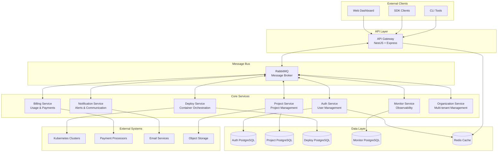
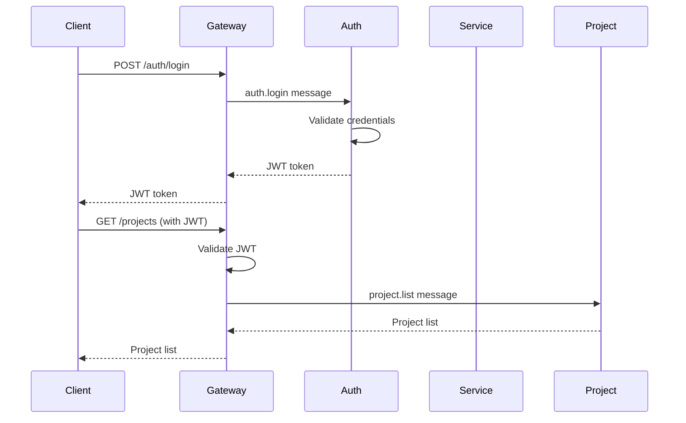

# System Architecture Overview

This document provides a comprehensive overview of the Capsule platform's system architecture, design principles, and component interactions.

## Table of Contents

- [Architecture Principles](#architecture-principles)
- [System Diagram](#system-diagram)
- [Component Overview](#component-overview)
- [Communication Patterns](#communication-patterns)
- [Data Architecture](#data-architecture)
- [Security Architecture](#security-architecture)
- [Deployment Architecture](#deployment-architecture)

## Architecture Principles

### Microservices Design

Capsule follows a **microservices architecture** with these core principles:

- **Single Responsibility**: Each service has one well-defined business responsibility
- **Autonomous Teams**: Services can be developed, deployed, and scaled independently  
- **Decentralized Data**: Each service owns its data (Database per Service pattern)
- **Fault Isolation**: Failures in one service don't cascade to others
- **Technology Diversity**: Services can use different technology stacks when appropriate

### Communication Patterns

- **Synchronous**: HTTP REST APIs for external clients via API Gateway
- **Asynchronous**: RabbitMQ message patterns for inter-service communication
- **Event-Driven**: Event sourcing and CQRS for complex business processes

### Scalability & Resilience

- **Horizontal Scaling**: Services scale independently based on load
- **Circuit Breakers**: Prevent cascade failures
- **Bulkhead Pattern**: Resource isolation between services
- **Graceful Degradation**: System continues operating with reduced functionality

## System Diagram



## Component Overview

### API Gateway

**Purpose**: Backend for Frontend (BFF) pattern - single entry point for all external clients

**Responsibilities**:
- Request routing and composition
- Authentication and authorization
- Rate limiting and throttling
- Request/response transformation
- API versioning and documentation
- Monitoring and logging

**Technology**: NestJS + Express

**Endpoints**:
- `POST /auth/login` → `auth.login` message
- `GET /projects` → `project.list` message  
- `POST /deployments` → `deploy.create` message

### Auth Service

**Purpose**: Centralized authentication and authorization

**Responsibilities**:
- User registration and login
- JWT token generation and validation
- Role-based access control (RBAC)
- Password reset and recovery
- Session management
- Multi-factor authentication (planned)

**Message Patterns**:
- `auth.register` - User registration
- `auth.login` - User authentication
- `auth.validate_token` - Token validation
- `auth.refresh_token` - Token refresh
- `auth.logout` - User logout

**Database**: Dedicated PostgreSQL instance with user data

### Project Service

**Purpose**: Project and application management

**Responsibilities**:
- Project CRUD operations
- Application configuration management
- Environment variable management
- Build configuration storage
- Team collaboration and permissions
- Project templates and scaffolding

**Message Patterns**:
- `project.create` - Create new project
- `project.update` - Update project settings
- `project.delete` - Delete project
- `project.list` - List user projects
- `project.get_config` - Get build configuration

### Deploy Service

**Purpose**: Container orchestration and deployment management

**Responsibilities**:
- Kubernetes cluster management
- Container image building
- Application deployment
- Rolling updates and rollbacks
- Load balancer configuration
- SSL certificate management
- Container registry management

**Message Patterns**:
- `deploy.create` - Deploy application
- `deploy.update` - Update deployment
- `deploy.rollback` - Rollback deployment
- `deploy.scale` - Scale application
- `deploy.get_status` - Get deployment status

### Monitor Service

**Purpose**: Observability and application monitoring

**Responsibilities**:
- Metrics collection and aggregation
- Log aggregation and search
- Application performance monitoring
- Infrastructure monitoring
- Alert rule management
- Dashboard generation
- Health check orchestration

**Message Patterns**:
- `monitor.collect_metrics` - Collect application metrics
- `monitor.store_logs` - Store application logs
- `monitor.create_alert` - Create alert rule
- `monitor.get_dashboard` - Get monitoring dashboard

### Notification Service

**Purpose**: Multi-channel notification delivery

**Responsibilities**:
- Email notifications
- SMS notifications (planned)
- Slack/Discord integrations
- In-app notifications
- Notification preferences
- Template management
- Delivery tracking

**Message Patterns**:
- `notification.send_email` - Send email notification
- `notification.send_slack` - Send Slack notification
- `notification.create_template` - Create notification template
- `notification.get_preferences` - Get user preferences

### Billing Service

**Purpose**: Usage tracking and billing management

**Responsibilities**:
- Resource usage tracking
- Cost calculation
- Invoice generation
- Payment processing
- Subscription management
- Usage quotas and limits
- Cost optimization recommendations

**Message Patterns**:
- `billing.track_usage` - Track resource usage
- `billing.calculate_cost` - Calculate usage cost
- `billing.generate_invoice` - Generate monthly invoice
- `billing.process_payment` - Process payment

### Organization Service

**Purpose**: Multi-tenant organization management

**Responsibilities**:
- Organization CRUD operations
- Team member management
- Role and permission management
- Resource quotas per organization
- Billing relationship management
- Organization settings and preferences

**Message Patterns**:
- `organization.create` - Create organization
- `organization.invite_member` - Invite team member
- `organization.set_permissions` - Set member permissions
- `organization.get_quota` - Get resource quotas

## Communication Patterns

### Request-Response Pattern

Used for operations that require immediate response:

```typescript
// API Gateway sends command and waits for response
const user = await this.authClient.send('auth.login', {
  email,
  password
});

// Auth Service processes and responds
@MessagePattern('auth.login')
async handleLogin(data: LoginDto) {
  const result = await this.authService.login(data);
  return { success: true, user: result.user, token: result.token };
}
```

### Event-Driven Pattern

Used for operations that trigger side effects in multiple services:

```typescript
// Deploy Service emits event after successful deployment
@MessagePattern('deploy.create')
async handleDeploy(data: DeployDto) {
  const deployment = await this.deployService.deploy(data);
  
  // Emit event for other services
  this.eventEmitter.emit('deployment.completed', {
    deploymentId: deployment.id,
    projectId: deployment.projectId,
    status: 'success'
  });
  
  return deployment;
}

// Monitor Service listens for deployment events
@EventPattern('deployment.completed')
async handleDeploymentCompleted(data: DeploymentCompletedEvent) {
  await this.monitorService.setupMonitoring(data.deploymentId);
}

// Notification Service also listens for deployment events
@EventPattern('deployment.completed')
async handleDeploymentCompleted(data: DeploymentCompletedEvent) {
  await this.notificationService.sendDeploymentSuccessNotification(data);
}
```

### Saga Pattern

Used for complex business processes that span multiple services:

```typescript
// Project creation saga
class ProjectCreationSaga {
  async execute(projectData: CreateProjectDto) {
    const transaction = new SagaTransaction();
    
    try {
      // Step 1: Create project
      const project = await transaction.execute(
        'project.create', 
        projectData,
        'project.delete' // compensation
      );
      
      // Step 2: Setup deployment environment
      const deployment = await transaction.execute(
        'deploy.setup_environment',
        { projectId: project.id },
        'deploy.cleanup_environment'
      );
      
      // Step 3: Setup monitoring
      await transaction.execute(
        'monitor.setup_project',
        { projectId: project.id, deploymentId: deployment.id },
        'monitor.cleanup_project'
      );
      
      return project;
      
    } catch (error) {
      await transaction.compensate();
      throw error;
    }
  }
}
```

## Data Architecture

### Database per Service

Each service has its own dedicated PostgreSQL instance:

```yaml
# Auth Service Database
auth-postgres:
  image: postgres:15-alpine
  environment:
    POSTGRES_DB: usecapsule_auth
    POSTGRES_USER: usecapsule_auth

# Project Service Database  
project-postgres:
  image: postgres:15-alpine
  environment:
    POSTGRES_DB: usecapsule_project
    POSTGRES_USER: usecapsule_project

# Deploy Service Database
deploy-postgres:
  image: postgres:15-alpine
  environment:
    POSTGRES_DB: usecapsule_deploy
    POSTGRES_USER: usecapsule_deploy
```

### Shared Cache Layer

Redis serves as shared cache for:
- Session storage
- Rate limiting counters
- Frequently accessed configuration
- Temporary data sharing between services

### Data Consistency Patterns

**Eventual Consistency**: Services sync via events
**Transactional Outbox**: Ensures message delivery with database transactions
**Saga Pattern**: Manages distributed transactions across services

## Security Architecture

### Authentication Flow



### Authorization Levels

1. **Public Routes**: No authentication required
   - Health checks
   - API documentation
   - Public landing pages

2. **API Key Routes**: Service-to-service authentication
   - CI/CD webhook endpoints
   - SDK client endpoints
   - Third-party integrations

3. **JWT Routes**: User authentication required
   - Dashboard endpoints
   - Project management
   - Account settings

### Security Measures

- **JWT with short expiration** (15 minutes)
- **Refresh token rotation**
- **Rate limiting per user/IP**
- **Input validation on all endpoints**
- **SQL injection prevention via Slonik**
- **XSS protection headers**
- **CORS configuration**
- **Secrets management via Vault**

## Deployment Architecture

### Container Strategy

Each service is containerized with:
- **Multi-stage builds** for optimized image size
- **Non-root user** for security
- **Health check endpoints**
- **Graceful shutdown handling**
- **Configuration via environment variables**

### Kubernetes Deployment

```yaml
# Example service deployment
apiVersion: apps/v1
kind: Deployment
metadata:
  name: auth-service
spec:
  replicas: 3
  selector:
    matchLabels:
      app: auth-service
  template:
    metadata:
      labels:
        app: auth-service
    spec:
      containers:
      - name: auth-service
        image: usecapsule/auth-service:latest
        ports:
        - containerPort: 3000
        env:
        - name: DATABASE_URL
          valueFrom:
            secretKeyRef:
              name: auth-db-secret
              key: url
        livenessProbe:
          httpGet:
            path: /health
            port: 3000
          initialDelaySeconds: 30
        readinessProbe:
          httpGet:
            path: /ready
            port: 3000
          initialDelaySeconds: 5
```

### Scaling Strategy

- **Horizontal Pod Autoscaler** based on CPU/memory metrics
- **Vertical scaling** for databases based on storage and connection needs
- **Load balancing** via Kubernetes services and ingress controllers
- **Database read replicas** for read-heavy services

### Monitoring & Observability

- **Prometheus metrics** collection from all services
- **Grafana dashboards** for system visualization
- **Distributed tracing** via OpenTelemetry
- **Centralized logging** via Elasticsearch/Fluentd/Kibana
- **Alert manager** for critical system alerts

This architecture provides a solid foundation for building a scalable, maintainable, and resilient cloud-native platform while maintaining clear separation of concerns and autonomous service development.