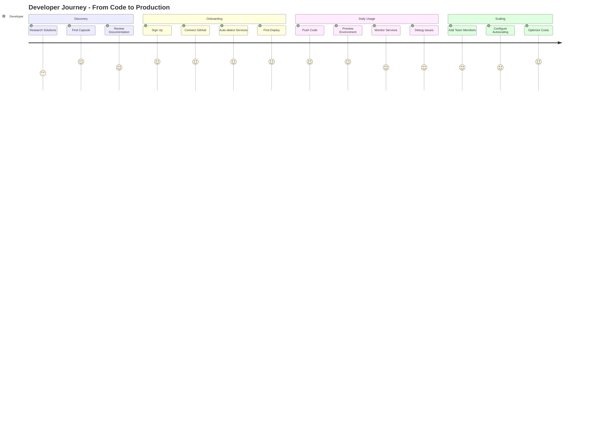
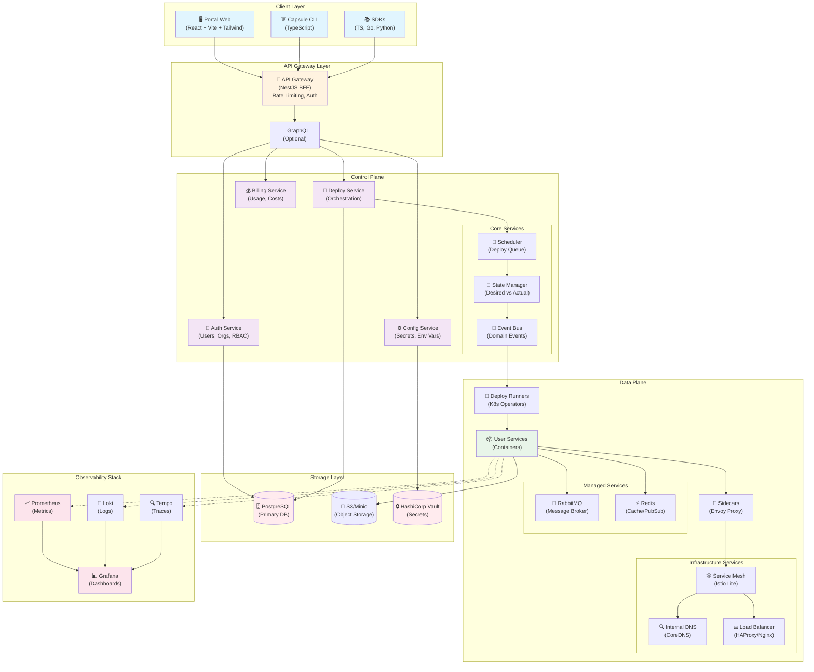
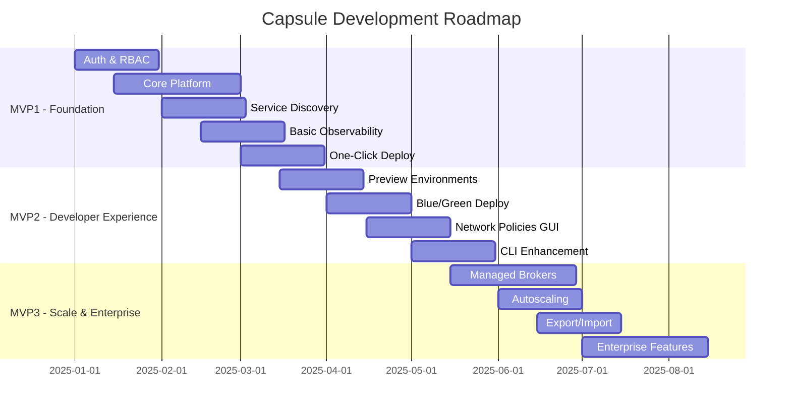

# Core Platform Features

# 📋 Product Requirements Document (PRD) - Capsule Platform

> **Version**: 2.0.0

> **Last Updated**: 2025-08-24

> **Status**: In Planning

> **Document Type**: Technical Product Specification

---

## 🎯 Executive Summary

### Product Vision Statement

Capsule é a **plataforma de deployment e gerenciamento de aplicações cloud-native** que simplifica a jornada do código à produção. Oferecemos uma experiência unificada para deploy de containers, microserviços, e aplicações full-stack - desde aplicações simples até arquiteturas empresariais complexas.

**Diferencial único**: Enquanto outras plataformas focam em nichos específicos (Vercel para Next.js, Heroku para apps simples), Capsule oferece flexibilidade total com a simplicidade de um PaaS, suportando:

- ✅ **Qualquer container Docker** (público ou privado)
- ✅ **Monorepos** (Nx, Turborepo, Lerna, Rush)
- ✅ **Microserviços** independentes
- ✅ **Aplicações full-stack** tradicionais
- ✅ **Workers e jobs** assíncronos
- ✅ **APIs e serviços** backend

### Core Value Proposition

**"Deploy anything, anywhere, in minutes - from simple containers to complex architectures"**

### Three Pillars of Capsule

1. **🚀 Universal Deployment**: Suporte para qualquer stack tecnológico
2. **🔍 Complete Observability**: Monitoramento, logs, traces e métricas em um só lugar
3. **👥 Team Collaboration**: Preview environments, RBAC, e workflows integrados

### Key Success Metrics

- **Time to First Deploy**: < 5 minutos (p50)
- **Zero-config Success Rate**: > 80% dos monorepos Nx
- **Developer Productivity**: 10+ deploys per developer per week
- **Infrastructure Cost Reduction**: 30% vs self-managed K8s

---

## 🔍 Problem Statement & Market Analysis

### 1. Current Market Problems

### 1.1 For Developers and Startups

- **🚧 Complexidade Desnecessária**
  - Configurar Kubernetes, service mesh, observability e CI/CD pode levar semanas
  - Dezenas de ferramentas e conceitos antes do primeiro deploy
  - Curva de aprendizado extremamente íngreme
- **💸 Custos Imprevisíveis**
  - Overprovisioning por medo de downtime
  - Surpresas constantes na fatura da cloud
  - Falta de visibilidade sobre custos por serviço
- **⏰ DevOps como Gargalo**
  - Pequenos times gastam 40% do tempo em infraestrutura
  - Falta de expertise específica em Kubernetes
  - Dependência de consultores externos caros

### 1.2 For Growing Companies

- **🔄 Migração Dolorosa**
  - Sair de PaaS simples (Heroku/Render) para arquitetura robusta é complexo
  - Perda de produtividade durante transição
  - Risco de downtime durante migração
- **🔒 Vendor Lock-in**
  - Presos em soluções proprietárias sem path de saída
  - APIs específicas que dificultam portabilidade
  - Custos crescentes sem alternativas viáveis
- **📊 Falta de Padronização**
  - Cada time reinventa a roda
  - Configurações divergentes entre projetos
  - Dificuldade de compartilhar conhecimento

### 2. Market Opportunity

### 2.1 Why Now?

1. **📦 Monorepos são o novo padrão**
   - Nx tem 2M+ downloads semanais
   - Grandes empresas adotando monorepos (Google, Meta, Microsoft)
   - Ferramentas maduras disponíveis
2. **🎯 Microserviços sem complexidade**
   - Teams querem benefícios sem overhead operacional
   - Necessidade de isolamento e escalabilidade independente
   - Demanda por arquiteturas event-driven
3. **💰 FinOps é crítico**
   - Pressão por eficiência de custos pós-2023
   - Necessidade de accountability por projeto/equipe
   - Automação de otimização de recursos
4. **✨ Developer Experience venceu**
   - Ferramentas que não são delightful morrem
   - Expectativa de onboarding em minutos, não dias
   - Demanda por ferramentas self-service

---

## 👥 Target Audience & Personas

### Primary Personas

### 1. 🚀 Startup CTO/Tech Lead

- **Company Size**: 50-200 funcionários
- **Team Size**: 5-20 developers, 0-2 DevOps
- **Tech Stack**: Nx monorepo, TypeScript, React/Angular/Vue + NestJS
- **Cloud Spend**: $5k-50k/mês
- **Pain Points**:
  - Tempo excessivo configurando infraestrutura
  - Falta de expertise em Kubernetes
  - Necessidade de ship fast sem sacrificar qualidade
- **Success Criteria**:
  - Deploy em produção < 1 dia
  - Redução de 50% no tempo gasto com DevOps
  - Custos previsíveis e controláveis

### 2. 🏢 Scale-up Engineering Manager

- **Company Size**: 200-1000 funcionários
- **Team Size**: Multiple squads, 20-100 developers
- **Tech Stack**: Microserviços, múltiplas linguagens
- **Cloud Spend**: $50k-500k/mês
- **Pain Points**:
  - Migração de PaaS para infraestrutura própria
  - Necessidade de isolamento entre equipes
  - Compliance e auditoria começando a importar
- **Success Criteria**:
  - Padronização entre equipes
  - Redução de incidentes relacionados a deploy
  - Visibilidade completa de custos por equipe

### 3. 🛠️ Full-stack Developer

- **Experience**: 2-10 anos
- **Responsibilities**: Frontend + Backend + Basic DevOps
- **Tools**: VS Code, GitHub, Docker basics
- **Pain Points**:
  - Frustração com complexidade de Kubernetes
  - Tempo perdido em configuração vs coding
  - Dificuldade em debugar problemas de produção
- **Success Criteria**:
  - Deploy tão simples quanto git push
  - Logs e métricas acessíveis facilmente
  - Preview environments automáticos

### User Journey Map



---

## 🎨 Core Features & Requirements

### Platform Capabilities Overview

Baseando-se no dashboard real da Capsule, a plataforma oferece um conjunto completo de funcionalidades para gerenciamento de aplicações modernas:

### 📊 **Dashboard Unificado**

- **Platform Overview**: Visão em tempo real de deployments, serviços, builds e performance
- **Services Management**: Monitoramento de CPU, memória, versões e status por serviço
- **Team Activity**: Commits recentes, pull requests, deployments por membro
- **Cost Tracking**: Budget monitoring com alertas e previsões ($2,847 of $5,000 budget)

### 🚀 **Deployment Flexibility**

- **Multiple Service Types**: API Gateway, User Services, Auth Services, Analytics Engines, Workers
- **Any Container Support**: Docker Hub, GHCR, ECR, private registries
- **Environment Management**: Production, Staging, Development com isolamento completo
- **Version Control**: Tracking de versões deployadas (v2.4.1, v1.7.3, etc)
- **Build Pipeline**: Status em tempo real (Running, Building, Failed)

### 👁️ **Preview Environments**

- **Automatic PR Environments**: Criação automática para cada pull request
- **Branch-based Deploys**: Environment isolado por branch (feature/payment-flow, etc)
- **Public URLs**: Links compartilháveis ([pr-123.preview.capsule.dev](http://pr-123.preview.capsule.dev))
- **Status Tracking**: Active, Building, Failed com timestamps
- **Quick Actions**: Deploy, destroy, logs, terminal access

### 📈 **Observability & Analytics**

- **System Performance**: Gráficos real-time de CPU, Memory Usage
- **Resource Usage**: CPU (45%), Memory (67%), Storage (23%), Network I/O (34%)
- **API Usage Analytics**:
  - Top Endpoints tracking (/api/v1/users: 24.5k requests)
  - Response Times (Average: 245ms, p95: 580ms, p99: 1.2s)
  - Request patterns com gráficos temporais
- **Security Monitoring**:
  - Real-time security scanning
  - Alertas categorizados (0 Critical, 2 Medium, 5 Low)
- **Compliance Dashboard**:
  - SOC 2 Type II: Compliant ✓
  - GDPR: Compliant ✓
  - PCI DSS: Audit pending
  - HIPAA: Compliant ✓

### 👥 **Team Collaboration**

- **Activity Feed**: Recent commits, PRs, deployments
- **Multi-user Support**: Team roles e permissões
- **Audit Trail**: Todas as ações registradas com autor e timestamp
- **Notifications**: Integração com Slack, email, webhooks

### Feature Priority Matrix

| Priority | Feature                        | MVP  | Impact | Effort | Owner     |
| -------- | ------------------------------ | ---- | ------ | ------ | --------- |
| P0       | 🎯 Universal Smart Deploy      | MVP1 | High   | Medium | Platform  |
| P0       | 📊 Unified Dashboard           | MVP1 | High   | Medium | Frontend  |
| P0       | 🔐 Authentication & RBAC       | MVP1 | High   | Medium | Platform  |
| P0       | 🚀 Multi-Service Deploy        | MVP1 | High   | Low    | Platform  |
| P0       | 🔍 Service Discovery + DNS     | MVP1 | High   | Medium | Infra     |
| P0       | 🔑 Config & Secrets Management | MVP1 | High   | Medium | Platform  |
| P0       | 📈 Real-time Monitoring        | MVP1 | High   | Medium | Infra     |
| P1       | 🔄 Blue/Green & Canary         | MVP2 | High   | Medium | Platform  |
| P1       | 👁️ Preview Environments        | MVP2 | High   | Medium | Platform  |
| P1       | 💰 Cost Analytics              | MVP2 | High   | Low    | Analytics |
| P1       | 🛡️ Security Scanning           | MVP2 | High   | Medium | Security  |
| P1       | 📡 API Analytics               | MVP2 | Medium | Low    | Analytics |
| P2       | 📨 Managed Brokers             | MVP3 | High   | High   | Infra     |
| P2       | 📦 Export/Import (IaC)         | MVP3 | High   | Medium | Platform  |
| P2       | ⚖️ Autoscaling                 | MVP3 | Medium | Medium | Infra     |
| P2       | 🏆 Compliance Automation       | MVP3 | High   | High   | Security  |

### Detailed Feature Specifications#### 🪄 F0: Universal Smart Deploy

### Description

Sistema inteligente de deployment que detecta automaticamente o tipo de aplicação e configura o ambiente ideal, suportando múltiplos paradigmas de deployment.

### Supported Deployment Methods

### 1. 📦 **Container-based Deploy**

- Docker images de qualquer registry (Docker Hub, GHCR, ECR, privados)
- Dockerfile no repositório com build automático
- Docker Compose para orquestração multi-container
- Import de Kubernetes manifests existentes

### 2. 🎯 **Monorepo Auto-detection**

- **Nx**: Detecção via nx.json e project.json
- **Turborepo**: Parse de turbo.json
- **Lerna**: Análise de lerna.json
- **Rush**: Rush.json configuration
- **Yarn/PNPM Workspaces**: Workspace detection

### 3. 📡 **Source Code Deploy**

- **Node.js**: package.json auto-detection
- **Python**: requirements.txt, Pipfile, pyproject.toml
- **Go**: go.mod analysis
- **Java**: Maven/Gradle support
- **Ruby**: Gemfile parsing
- **.NET**: Project file detection

### 4. 🌐 **Static Sites & SPAs**

- Auto-detect build outputs
- CDN deployment with edge optimization
- Framework-specific optimizations

### Intelligent Configuration

```tsx
interface SmartDeployConfig {
  // Auto-detected settings
  detected: {
    type: 'container' | 'monorepo' | 'source' | 'static';
    framework?: string;
    language?: string;
    ports?: number[];
    commands?: {
      build?: string;
      start?: string;
      test?: string;
    };
  };

  // Suggested optimizations
  suggestions: {
    caching?: CacheStrategy;
    scaling?: ScalingPolicy;
    healthCheck?: HealthCheckConfig;
    resources?: ResourceLimits;
  };

  // Override options
  customizable: {
    env: Record<string, string>;
    secrets: string[];
    volumes?: VolumeMount[];
    networking?: NetworkConfig;
  };
}
```

### Framework-Specific Features

| Framework       | Auto-Detection                | Optimizations                               |
| --------------- | ----------------------------- | ------------------------------------------- |
| **Next.js**     | package.json + next.config    | SSR/SSG/ISR, Image optimization, API routes |
| **React**       | package.json + public/        | SPA routing, CDN distribution               |
| **Vue**         | package.json + vue.config     | Build optimization, Route handling          |
| **Angular**     | angular.json                  | AOT compilation, Service workers            |
| **NestJS**      | @nestjs/core in deps          | Microservice mode, Health checks            |
| **Express**     | express in deps               | Cluster mode, Graceful shutdown             |
| **Django**      | [manage.py](http://manage.py) | Static files, Migrations, WSGI/ASGI         |
| **Rails**       | Gemfile + Rakefile            | Asset pipeline, Database tasks              |
| **Spring Boot** | pom.xml/gradle                | Actuator integration, JVM tuning            |
| **Laravel**     | composer.json + artisan       | Queue workers, Scheduling                   |
| **FastAPI**     | fastapi in deps               | ASGI server, OpenAPI docs                   |
| **Flask**       | flask in deps                 | WSGI config, Static files                   |

### Acceptance Criteria

- ✅ GIVEN any GitHub/GitLab/Bitbucket repository
  - WHEN connected to platform
  - THEN application type detected in < 30s
- ✅ GIVEN a Docker image URL
  - WHEN deployment triggered
  - THEN service running in < 2 minutes
- ✅ GIVEN a monorepo with multiple projects
  - WHEN code pushed
  - THEN only affected projects redeployed
- ✅ GIVEN unknown framework
  - WHEN detection fails
  - THEN fallback to generic container with manual config

### Success Metrics

- 85% zero-config deployment success
- 95% framework detection accuracy
- < 3 min average deployment time
- 98% successful first deployment rate

---

### 🔐 F1: Authentication & Authorization (RBAC)

### Description

Complete authentication system with multi-provider support and granular role-based access control.

### Functional Requirements

### Authentication Methods

1. **OAuth Providers**
   - GitHub OAuth (primary)
   - Google OAuth
   - GitLab OAuth
   - SAML SSO (Enterprise)
2. **Email/Password**
   - Registration with email verification
   - Password reset flow
   - 2FA support (TOTP)
3. **API Keys**
   - Scoped permissions
   - Expiration dates
   - Usage tracking
   - Rate limiting

### Authorization Roles

| Role      | Permissions                 | Scope |
| --------- | --------------------------- | ----- |
| **Owner** | • Full organization control |

• Billing management
• Delete organization
• All Admin permissions | Organization |
| **Admin** | • Create/delete projects
• Manage members
• Configure integrations
• All Developer permissions | Organization/Project |
| **Developer** | • Deploy services
• Manage secrets
• View logs/metrics
• Create preview envs | Project/Environment |
| **Viewer** | • Read-only access
• View services
• View logs
• Export reports | Project/Environment |

### Technical Requirements

```tsx
interface AuthContext {
  user: {
    id: string;
    email: string;
    name: string;
    avatar?: string;
  };

  organization: {
    id: string;
    name: string;
    plan: 'free' | 'pro' | 'enterprise';
  };

  permissions: Permission[];

  tokens: {
    access: string;
    refresh: string;
    expiresAt: Date;
  };
}

interface Permission {
  resource: 'org' | 'project' | 'service' | 'secret';
  action: 'create' | 'read' | 'update' | 'delete';
  scope?: string; // project-id, env-name, etc
}
```

### Acceptance Criteria

- ✅ OAuth login completes in < 2s (p50)
- ✅ RBAC denies unauthorized actions with proper 403 responses
- ✅ API Keys work for CI/CD with scoped permissions
- ✅ Token refresh happens seamlessly without re-login
- ✅ All actions are logged in audit trail

---

### 🚀 F2: One-Click Deploy

### Description

Streamlined deployment of container images with intelligent defaults and health monitoring.

### Functional Requirements

1. **Registry Integration**
   - Docker Hub (public/private)
   - GitHub Container Registry (GHCR)
   - Amazon ECR
   - Custom registries with credentials
2. **Deployment Configuration**
   - Auto-detect exposed ports
   - Generate health check endpoints
   - Environment variable management
   - Resource limits (CPU/Memory)
   - Replica count
3. **Deployment Process**
   - Pull image with retry logic
   - Rolling update strategy
   - Health check validation
   - Automatic rollback on failure
   - Real-time log streaming

### API Specification

```yaml
POST /api/v1/services
Content-Type: application/json

{
  "name": "api-service",
  "image": "[ghcr.io/org/api:v1.2.3](http://ghcr.io/org/api:v1.2.3)",
  "ports": [{
    "container": 3000,
    "protocol": "http"
  }],
  "env": {
    "NODE_ENV": "production",
    "API_KEY": "@secret:api-key"
  },
  "resources": {
    "cpu": "500m",
    "memory": "512Mi"
  },
  "healthCheck": {
    "path": "/health",
    "interval": 30,
    "timeout": 10
  },
  "replicas": {
    "min": 2,
    "max": 10
  }
}

Response: 201 Created
{
  "id": "svc_abc123",
  "status": "deploying",
  "url": "[https://api-service.capsule.app](https://api-service.capsule.app)",
  "endpoints": {
    "public": "[https://api-service.capsule.app](https://api-service.capsule.app)",
    "internal": "api-service.internal:3000"
  }
}
```

---

## 🏗️ Technical Architecture

### System Architecture Overview



### Domain-Driven Design Structure

```
📁 monorepo/
├── 📁 apps/
│   ├── 📁 api-gateway/          # BFF for Portal
│   ├── 📁 service-auth/         # Authentication & RBAC
│   ├── 📁 service-deploy/       # Deployment orchestration
│   ├── 📁 service-config/       # Configuration management
│   ├── 📁 service-billing/      # Usage and billing
│   ├── 📁 worker-deployer/      # Async deployment jobs
│   ├── 📁 worker-scaler/        # Autoscaling decisions
│   └── 📁 portal/               # React frontend
│
├── 📁 libs/
│   ├── 📁 contexts/             # DDD Bounded Contexts
│   │   ├── 📁 auth/
│   │   │   ├── 📁 domain/
│   │   │   │   ├── 📁 entities/
│   │   │   │   │   ├── User.entity.ts
│   │   │   │   │   ├── Organization.entity.ts
│   │   │   │   │   └── ApiKey.entity.ts
│   │   │   │   ├── 📁 value-objects/
│   │   │   │   │   ├── Email.vo.ts
│   │   │   │   │   ├── Role.vo.ts
│   │   │   │   │   └── Permission.vo.ts
│   │   │   │   └── 📁 events/
│   │   │   │       └── UserCreated.event.ts
│   │   │   ├── 📁 application/
│   │   │   │   ├── 📁 use-cases/
│   │   │   │   ├── 📁 ports/
│   │   │   │   └── 📁 dtos/
│   │   │   └── 📁 infrastructure/
│   │   │       ├── 📁 adapters/
│   │   │       └── 📁 repositories/
│   │   │
│   │   ├── 📁 deployment/
│   │   ├── 📁 configuration/
│   │   └── 📁 billing/
│   │
│   ├── 📁 shared/               # Shared across contexts
│   │   ├── 📁 kernel/           # Shared domain primitives
│   │   ├── 📁 infrastructure/   # Cross-cutting concerns
│   │   └── 📁 types/            # TypeScript types
│   │
│   └── 📁 ui/                   # Frontend component library
│       ├── 📁 components/
│       ├── 📁 hooks/
│       └── 📁 utils/
│
├── 📁 tools/
│   ├── 📁 generators/           # Nx generators
│   └── 📁 scripts/              # Build & deploy scripts
│
├── nx.json
├── package.json
└── tsconfig.base.json
```

### API Design Principles

### RESTful API Standards

```yaml
# Resource naming
GET    /api/v1/organizations
GET    /api/v1/organizations/{id}
POST   /api/v1/organizations
PATCH  /api/v1/organizations/{id}
DELETE /api/v1/organizations/{id}

# Nested resources
GET    /api/v1/organizations/{id}/projects
POST   /api/v1/projects/{id}/services
GET    /api/v1/services/{id}/deployments

# Actions as sub-resources
POST   /api/v1/services/{id}/deploy
POST   /api/v1/services/{id}/rollback
POST   /api/v1/services/{id}/scale

# Query parameters
GET    /api/v1/services?status=running&env=production
GET    /api/v1/logs?service={id}&since=2024-01-01&limit=100

# Pagination
GET    /api/v1/deployments?page=2&per_page=20
Response Headers:
  X-Total-Count: 200
  X-Page: 2
  X-Per-Page: 20
  Link: <...?page=3>; rel="next", <...?page=1>; rel="prev"
```

### Error Handling

```json
{
  "error": {
    "code": "RESOURCE_NOT_FOUND",
    "message": "Service with ID 'svc_123' not found",
    "details": {
      "resource_type": "service",
      "resource_id": "svc_123"
    },
    "request_id": "req_abc123",
    "timestamp": "2024-01-15T10:30:00Z"
  }
}
```

---

## 🛠️ Developer Experience

### CLI Tool Specifications

### Installation & Setup

```bash
# Installation methods
npm install -g @capsule/cli
brew install capsule
curl -sSL [https://get.capsule.dev](https://get.capsule.dev) | sh

# Initial setup
capsule auth login
capsule init
```

### Core Commands

```bash
# Project Management
capsule init [--template <template>]     # Initialize new project
capsule validate                         # Validate configuration
capsule status                          # Show project status

# Deployment Commands
capsule deploy [service] [--env <env>]  # Deploy service(s)
capsule rollback <deployment-id>        # Rollback deployment
capsule promote <from-env> <to-env>     # Promote between environments

# Service Management
capsule services list                   # List all services
capsule services logs <service> [-f]    # View/follow logs
capsule services exec <service> -- <cmd> # Execute command
capsule services restart <service>      # Restart service
capsule services scale <service> <num>  # Scale service

# Environment Management
capsule env list                        # List environments
capsule env create <name>               # Create environment
capsule env clone <from> <to>           # Clone environment

# Preview Environments
capsule preview create --branch <branch> # Create preview
capsule preview list                    # List previews
capsule preview destroy <id>            # Destroy preview

# Configuration & Secrets
capsule config set KEY=value            # Set config
capsule secrets set KEY=value           # Set secret
capsule secrets list                    # List secrets

# Monitoring & Debugging
capsule metrics <service>               # View metrics
capsule trace <request-id>              # Trace request
capsule debug <service> [--port 9229]   # Remote debugging

# Cost Management
capsule cost current                    # Current month costs
capsule cost forecast                   # Cost forecast
capsule cost breakdown [--by service]   # Detailed breakdown

# Import/Export
capsule import <source> [--dry-run]     # Import from other platforms
capsule export --format <format>        # Export configuration
```

### Configuration File Schema

```yaml
# capsule.yaml
version: '1.0'

# Project metadata
project:
  name: 'my-awesome-app'
  description: 'E-commerce platform'
  team: 'platform-team'

# Environments
environments:
  development:
    variables:
      NODE_ENV: 'development'
      LOG_LEVEL: 'debug'

  staging:
    variables:
      NODE_ENV: 'staging'
      LOG_LEVEL: 'info'
    preview:
      enabled: true
      ttl: '24h'

  production:
    variables:
      NODE_ENV: 'production'
      LOG_LEVEL: 'warn'
    protection:
      enabled: true
      required_reviews: 2

# Services configuration
services:
  api:
    # Source configuration
    source:
      type: 'dockerfile'
      path: './apps/api'
      dockerfile: 'Dockerfile'

    # Or use image directly
    # image: "[ghcr.io/org/api:latest](http://ghcr.io/org/api:latest)"

    # Runtime configuration
    runtime:
      command: ['node', 'dist/main.js']
      port: 3000
      protocol: 'http'

    # Resources
    resources:
      cpu: '500m'
      memory: '512Mi'

    # Health checks
    health:
      path: '/health'
      interval: 30
      timeout: 10
      retries: 3

    # Scaling
    scaling:
      min: 2
      max: 10
      metrics:
        - type: 'cpu'
          target: 70
        - type: 'rps'
          target: 1000

    # Environment variables
    env:
      DATABASE_URL: '@secret:database-url'
      REDIS_URL: '@broker:redis'
      API_KEY: '@secret:api-key'

    # Dependencies
    depends_on:
      - 'database-migration'

  frontend:
    source:
      type: 'static'
      path: './apps/frontend/dist'

    # CDN configuration
    cdn:
      enabled: true
      cache_control: 'public, max-age=3600'

    # Routing
    routes:
      - path: '/*'
        rewrite: '/index.html'

  worker:
    source:
      type: 'dockerfile'
      path: './apps/worker'

    runtime:
      protocol: 'worker'

    # Queue configuration
    queues:
      - name: 'email-queue'
        broker: 'rabbitmq'
      - name: 'payment-queue'
        broker: 'rabbitmq'

    scaling:
      min: 1
      max: 5
      metrics:
        - type: 'queue-depth'
          target: 100

# Managed brokers
brokers:
  rabbitmq:
    type: 'rabbitmq'
    plan: 'small'
    version: '3.11'

  redis:
    type: 'redis'
    plan: 'small'
    version: '7.0'
    mode: 'pubsub'

# Network policies
network:
  policies:
    - name: 'api-policy'
      ingress:
        - from: 'internet'
          ports: [443]
      egress:
        - to: 'database'
          ports: [5432]
        - to: 'redis'
          ports: [6379]

    - name: 'worker-policy'
      ingress: []
      egress:
        - to: 'rabbitmq'
          ports: [5672]
        - to: 'external-api'
          ports: [443]

# Observability
observability:
  logs:
    level: 'info'
    format: 'json'
    retention: '7d'

  metrics:
    enabled: true
    interval: 30

  tracing:
    enabled: true
    sampling: 0.1

# Cost controls
cost:
  budget:
    monthly: 1000
    alerts:
      - threshold: 70
        channel: 'email'
      - threshold: 90
        channel: 'slack'

  optimization:
    idle_shutdown: true
    idle_timeout: '30m'
```

### SDK Examples

### TypeScript/JavaScript SDK

```tsx
import { CapsuleClient } from '@capsule/sdk';

// Initialize client
const capsule = new CapsuleClient({
  apiKey: process.env.CAPSULE_API_KEY,
  projectId: process.env.CAPSULE_PROJECT_ID
});

// Deploy a service
const deployment = await [capsule.services](http://capsule.services).deploy({
  name: 'api-service',
  image: '[ghcr.io/org/api:v2.0.0](http://ghcr.io/org/api:v2.0.0)',
  env: {
    NODE_ENV: 'production'
  },
  scaling: {
    min: 2,
    max: 10
  }
});

// Monitor deployment
const status = await capsule.deployments.getStatus([deployment.id](http://deployment.id));

// Stream logs
const logStream = [capsule.services](http://capsule.services).logs('api-service', {
  follow: true,
  since: '10m'
});

logStream.on('data', (log) => {
  console.log(log);
});

// Get metrics
const metrics = await [capsule.services](http://capsule.services).metrics('api-service', {
  period: '1h',
  metrics: ['cpu', 'memory', 'rps']
});

// Manage secrets
await capsule.secrets.set('API_KEY', 'secret-value');
const secrets = await capsule.secrets.list();

// Cost analysis
const costs = await capsule.billing.getCurrentMonth();
const forecast = await capsule.billing.forecast();
```

### Python SDK

```python
from capsule import CapsuleClient
import os

# Initialize client
client = CapsuleClient(
    api_key=os.environ['CAPSULE_API_KEY'],
    project_id=os.environ['CAPSULE_PROJECT_ID']
)

# Deploy a service
deployment = [client.services](http://client.services).deploy(
    name='api-service',
    image='[ghcr.io/org/api:v2.0.0](http://ghcr.io/org/api:v2.0.0)',
    env={
        'NODE_ENV': 'production'
    },
    scaling={
        'min': 2,
        'max': 10
    }
)

# Monitor deployment
status = client.deployments.get_status([deployment.id](http://deployment.id))

# Stream logs
for log in [client.services](http://client.services).logs('api-service', follow=True):
    print(log)

# Get metrics
metrics = [client.services](http://client.services).metrics(
    'api-service',
    period='1h',
    metrics=['cpu', 'memory', 'rps']
)

# Manage secrets
client.secrets.set('API_KEY', 'secret-value')
secrets = client.secrets.list()

# Cost analysis
costs = client.billing.get_current_month()
forecast = client.billing.forecast()
```

---

## 📅 Implementation Roadmap

### Development Phases



### MVP1: Foundation (Q1 2025)

### Goals

- ✅ Basic platform operational
- ✅ Core deployment functionality
- ✅ Essential developer tools

### Deliverables

| Feature             | Priority | Success Criteria                      |
| ------------------- | -------- | ------------------------------------- |
| Auth & RBAC         | P0       | OAuth login < 2s, API keys functional |
| Nx Auto-detection   | P0       | 80% zero-config success rate          |
| One-Click Deploy    | P0       | Deploy time < 60s (p50)               |
| Service Discovery   | P0       | DNS resolution < 100ms                |
| Config Management   | P0       | Secrets never exposed in logs         |
| Basic Observability | P0       | Logs searchable < 2s                  |

### Technical Milestones

1. **Week 1-2**: Project setup, monorepo structure
2. **Week 3-4**: Auth service with OAuth providers
3. **Week 5-8**: Core deployment engine
4. **Week 9-10**: Service discovery and DNS
5. **Week 11-12**: Observability stack
6. **Week 13-14**: Testing and stabilization

### MVP2: Developer Experience (Q2 2025)

### Goals

- ✅ Streamlined development workflow
- ✅ Advanced deployment strategies
- ✅ Visual management tools

### Deliverables

| Feature              | Priority | Success Criteria             |
| -------------------- | -------- | ---------------------------- |
| Preview Environments | P1       | 80% of PRs with preview      |
| Blue/Green Deploy    | P1       | Rollback < 30s               |
| Canary Deployments   | P1       | Automatic rollback on errors |
| Network Policies GUI | P1       | 90% policies via UI          |
| Enhanced CLI         | P1       | All operations available     |
| VS Code Extension    | P2       | IntelliSense for config      |

### MVP3: Scale & Enterprise (Q3 2025)

### Goals

- ✅ Production-ready for enterprise
- ✅ Cost optimization features
- ✅ Vendor-agnostic portability

### Deliverables

| Feature         | Priority | Success Criteria           |
| --------------- | -------- | -------------------------- |
| Managed Brokers | P2       | Provisioning < 3min        |
| Autoscaling     | P2       | 20% cost reduction         |
| Export/Import   | P2       | K8s/Helm/Terraform support |
| SAML SSO        | P2       | Enterprise auth support    |
| Audit Logs      | P2       | Compliance ready           |
| Multi-region    | P3       | Global deployment          |

---

## 📊 Success Metrics & KPIs

### Business Metrics

### Growth Metrics

- **Monthly Active Teams**: Target 1000 by end of Year 1
- **Revenue Growth**: 20% MoM for first 6 months
- **Customer Acquisition Cost**: < $500 per customer
- **Lifetime Value**: > $10,000 per customer
- **Churn Rate**: < 3% monthly for paying customers

### Engagement Metrics

- **Weekly Active Usage**: > 70% of registered teams
- **Services per Account**: Average 5+ services
- **Deployment Frequency**: 10+ per week per team
- **Preview Environment Adoption**: > 50% of PRs

### Technical Metrics

### Performance Metrics

- **Time to First Deploy**: < 5 minutes (p50)
- **Deployment Success Rate**: > 99%
- **API Response Time**: < 200ms (p95)
- **Availability**: > 99.9% uptime

### Developer Experience Metrics

- **Onboarding Completion**: > 80% in first session
- **CLI Usage**: > 60% of users
- **Documentation Satisfaction**: > 4.5/5 rating
- **Support Ticket Resolution**: < 4 hours (p50)

### Operational Metrics

### Infrastructure Efficiency

- **Resource Utilization**: > 70% average
- **Cost per Service**: 30% lower than self-managed
- **Autoscaling Accuracy**: < 5% over-provisioning
- **Incident Rate**: < 1 per month per 100 services

---

## 🚨 Risk Analysis & Mitigation

### Technical Risks

| Risk                               | Impact | Probability | Mitigation Strategy       |
| ---------------------------------- | ------ | ----------- | ------------------------- |
| **Multi-tenant isolation failure** | High   | Low         | • Strict network policies |

• Resource quotas
• Security audits
• Penetration testing |
| **Scaling bottlenecks** | High | Medium | • Horizontal scaling design
• Load testing
• Cache layers
• CDN usage |
| **Data loss** | Critical | Low | • Automated backups
• Multi-region replication
• Disaster recovery plan
• Regular restore tests |
| **Vendor lock-in concerns** | Medium | Medium | • Export functionality
• Open standards
• Kubernetes compatibility
• Avoid proprietary APIs |

### Business Risks

| Risk              | Impact | Probability | Mitigation Strategy  |
| ----------------- | ------ | ----------- | -------------------- |
| **Slow adoption** | High   | Medium      | • Generous free tier |

• Migration tools
• Onboarding assistance
• Community building |
| **Competition from cloud providers** | High | Medium | • Superior DX
• Faster innovation
• Niche focus
• Cost advantages |
| **Pricing model issues** | Medium | Medium | • Usage-based pricing
• Transparent costs
• Cost alerts
• Optimization tools |

### Security Risks

| Risk                | Impact   | Probability | Mitigation Strategy  |
| ------------------- | -------- | ----------- | -------------------- |
| **Secret exposure** | Critical | Low         | • Encryption at rest |

• Vault integration
• Audit logging
• Secret rotation |
| **DDoS attacks** | High | Medium | • Rate limiting
• CDN protection
• Auto-scaling
• Traffic filtering |
| **Supply chain attacks** | High | Low | • Image scanning
• Dependency updates
• SBOM generation
• Vulnerability alerts |

---

## 📝 Appendix

### A. Glossary

| Term                       | Definition                                                          |
| -------------------------- | ------------------------------------------------------------------- |
| **BFF**                    | Backend for Frontend - API specifically designed for frontend needs |
| **Bounded Context**        | DDD concept - cohesive model boundary                               |
| **Canary Deployment**      | Gradual rollout to subset of users                                  |
| **CQRS**                   | Command Query Responsibility Segregation                            |
| **DDD**                    | Domain-Driven Design                                                |
| **Event Sourcing**         | Storing state changes as event sequence                             |
| **Hexagonal Architecture** | Ports and adapters pattern                                          |
| **mTLS**                   | Mutual TLS - two-way authentication                                 |
| **OTLP**                   | OpenTelemetry Protocol                                              |
| **RBAC**                   | Role-Based Access Control                                           |
| **Service Mesh**           | Infrastructure layer for service communication                      |
| **Sidecar**                | Container deployed alongside main service                           |

### B. Competitive Analysis

| Feature              | Capsule   | Vercel       | Render        | Heroku     | Railway    |
| -------------------- | --------- | ------------ | ------------- | ---------- | ---------- |
| Nx Monorepo Support  | ✅ Native | ⚠️ Limited   | ❌            | ❌         | ⚠️ Limited |
| Microservices        | ✅ Full   | ⚠️ Functions | ✅            | ⚠️ Limited | ✅         |
| Preview Environments | ✅        | ✅           | ✅            | ✅         | ✅         |
| Managed Brokers      | ✅        | ❌           | ⚠️ Redis only | ⚠️ Limited | ⚠️ Limited |
| Service Mesh         | ✅        | ❌           | ❌            | ❌         | ❌         |
| Export to K8s        | ✅        | ❌           | ❌            | ❌         | ❌         |
| Cost Transparency    | ✅ Full   | ⚠️           | ✅            | ⚠️         | ✅         |
| Self-hosting Option  | ✅        | ❌           | ❌            | ❌         | ❌         |

### C. API Examples

### Service Deployment

```bash
curl -X POST [https://api.capsule.dev/v1/services](https://api.capsule.dev/v1/services) \
  -H "Authorization: Bearer ${API_KEY}" \
  -H "Content-Type: application/json" \
  -d '{
    "name": "api-service",
    "image": "[ghcr.io/org/api:latest](http://ghcr.io/org/api:latest)",
    "env": {
      "NODE_ENV": "production"
    }
  }'
```

### Canary Deployment

```bash
curl -X POST [https://api.capsule.dev/v1/services/svc_123/canary](https://api.capsule.dev/v1/services/svc_123/canary) \
  -H "Authorization: Bearer ${API_KEY}" \
  -H "Content-Type: application/json" \
  -d '{
    "image": "[ghcr.io/org/api:v2](http://ghcr.io/org/api:v2)",
    "percentage": 10,
    "duration": "30m"
  }'
```

### Preview Environment

```bash
curl -X POST [https://api.capsule.dev/v1/previews](https://api.capsule.dev/v1/previews) \
  -H "Authorization: Bearer ${API_KEY}" \
  -H "Content-Type: application/json" \
  -d '{
    "branch": "feature/new-ui",
    "ttl": "24h"
  }'
```

### D. References & Resources

### Technical Documentation

- [Kubernetes API Reference](https://kubernetes.io/docs/reference/)
- [OpenTelemetry Specification](https://opentelemetry.io/docs/)
- [Nx Documentation](https://nx.dev/)
- [NestJS Documentation](https://nestjs.com/)
- [Domain-Driven Design Reference](https://www.domainlanguage.com/ddd/)

### Industry Reports

- State of DevOps Report 2024
- CNCF Survey Results
- Developer Experience Index

### Compliance & Security

- SOC 2 Type II Requirements
- GDPR Compliance Guidelines
- OWASP Top 10
- CIS Kubernetes Benchmark

---

## 📞 Contact & Support

**Product Owner**: [product@capsule.dev](mailto:product@capsule.dev)

**Technical Lead**: [tech@capsule.dev](mailto:tech@capsule.dev)

**Documentation**: [docs.capsule.dev](http://docs.capsule.dev)

**Community**: [discord.gg/capsule](http://discord.gg/capsule)

---

_This document is a living specification and will be updated as the product evolves._
