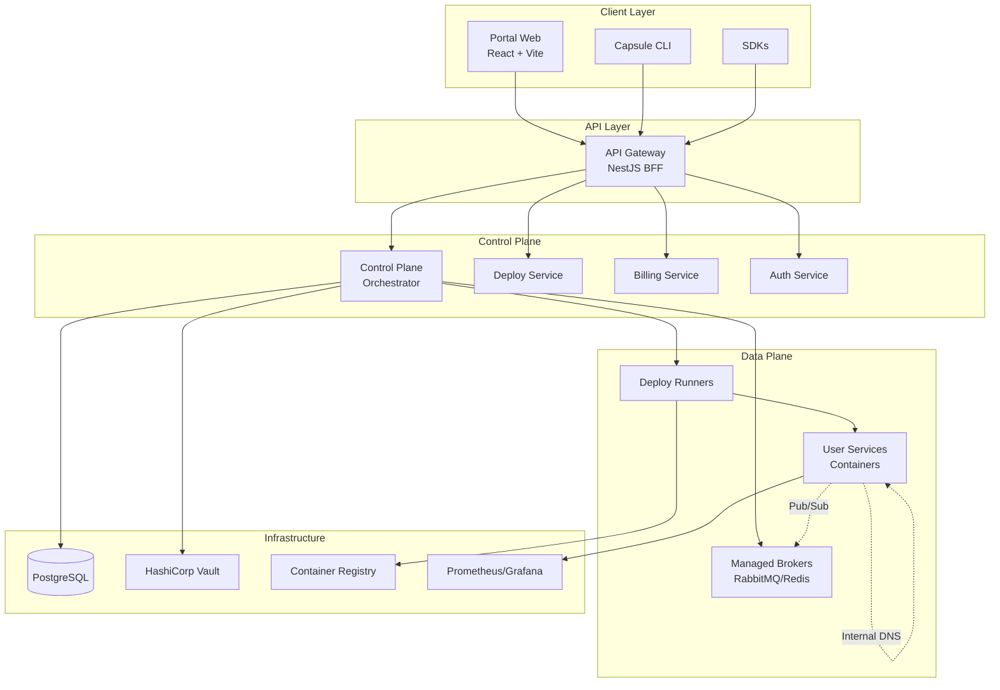

# Core Platform Features

## Overview

### Visão

Capsule é a plataforma que transforma monorepos Nx em aplicações production-ready com um único comando. Assim como a Vercel revolucionou o deploy de aplicações Next.js, Capsule faz o mesmo para arquiteturas empresariais complexas - detectando automaticamente microserviços, frontends e workers em seu monorepo, configurando toda a infraestrutura necessária (service mesh, brokers, observability) e deployando com configuração zero.

**Nossa promessa**: Do código ao production em menos de 5 minutos, sem YAML, sem Kubernetes, sem dor de cabeça.

### O Problema Real

### Para Desenvolvedores e Startups

- **Complexidade desnecessária**: Configurar Kubernetes, service mesh, observability e CI/CD pode levar semanas
- **Curva de aprendizado brutal**: Dezenas de ferramentas e conceitos antes do primeiro deploy
- **Custos imprevisíveis**: Overprovisioning por medo, surpresas na fatura da cloud
- **DevOps como gargalo**: Pequenos times gastam 40% do tempo em infraestrutura

### Para Empresas em Crescimento

- **Migração dolorosa**: Sair de PaaS simples (Heroku/Render) para arquitetura robusta é um salto mortal
- **Vendor lock-in**: Presos em soluções proprietárias sem path de saída
- **Falta de padronização**: Cada time reinventa a roda, configurações divergentes
- **Observability fragmentada**: Logs, métricas e traces em ferramentas separadas

### Por que agora?

1. **Monorepos são o novo padrão**: Nx, Turborepo e Rush dominam empresas modernas
2. **Microserviços sem a complexidade**: Teams querem os benefícios sem o overhead operacional
3. **FinOps é crítico**: Pressão por eficiência de custos pós-2023
4. **Developer Experience venceu**: Ferramentas que não são delightful morrem

### Público-alvo Primário

### 1. Early Adopters (MVP1)

- **Startup CTOs/Tech Leads** (50-200 funcionários)
  - Usando Nx/monorepo mas sofrendo com deploy
  - Gastando $5k-50k/mês em cloud
  - Time de 5-20 devs, 0-2 DevOps

### 2. Expansão (MVP2)

- **Scale-ups** (200-1000 funcionários)
  - Migrando de Heroku/Render para arquitetura própria
  - Multiple squads, precisam de isolamento
  - Compliance e auditoria começando a importar

### 3. Enterprise (MVP3)

- **Empresas estabelecidas** com iniciativas de modernização
  - Querem alternativa ao EKS/GKE gerenciado
  - Precisam de exit strategy (export para K8s)
  - Multi-cloud e hybrid cloud requirements

### Métricas de Sucesso do Produto

### Ativação (Primeiras 4 semanas)

- **Time to First Deploy**: < 5 minutos (p50), < 10 minutos (p90)
- **Zero-config success rate**: > 80% dos monorepos Nx deployam sem configuração manual
- **Ativação D7**: > 60% dos trials fazem 5+ deploys na primeira semana

### Engajamento (Mês 2-3)

- **Weekly Active Teams**: > 70% dos times ativos semanalmente
- **Services per Account**: média de 5+ serviços por conta ativa
- **Preview Environments**: > 50% dos PRs com preview automático

### Retenção (Trimestre)

- **3-month retention**: > 85% das contas pagas
- **Revenue expansion**: > 140% NRR (net revenue retention)
- **Churn < 3% mensal** para contas > $500/mês

### North Star Metrics

- **Deploys per Developer per Week**: > 10 (vs. 2-3 industry average)
- **MTTR (Mean Time to Recovery)**: < 10 minutos com rollback automático
- **Infrastructure Cost Efficiency**: 30% redução vs. self-managed K8s

## Core Features Expandidas

### 0. 🪄 Magic Deploy para Monorepos Nx (Hero Feature - MVP1)

**Descrição**

Deploy automático e inteligente de monorepos Nx com detecção de arquitetura, igual Vercel faz com Next.js. Capsule analisa seu `nx.json`, detecta todos os apps (React, Angular, Vue, NestJS, Express), entende as dependências entre eles, e faz o deploy de tudo com configuração zero.

**Como funciona a mágica**

1. **Connect GitHub**: Autoriza o repo
2. **Auto-discovery**: Capsule escaneia e encontra:
   - Frontend apps → gera URLs públicas com CDN
   - API/Backend services → configura API Gateway
   - Workers/Jobs → setup de filas automático
   - Shared libs → otimização de build
3. **Smart Routing**: Cria rotas automáticas baseadas em nomes
   - `apps/web` → [`myapp.capsule.dev`](http://myapp.capsule.dev)
   - `apps/api` → [`api.myapp.capsule.dev`](http://api.myapp.capsule.dev)
   - `apps/admin` → [`admin.myapp.capsule.dev`](http://admin.myapp.capsule.dev)
4. **Instant Deploy**: Um clique, tudo no ar

**Acceptance Criteria**

- GIVEN um monorepo Nx com 5+ apps; WHEN conectado ao GitHub; THEN Capsule detecta todos os apps e suas dependências em < 30s
- GIVEN apps com `project.json` padrão; WHEN deploy é triggered; THEN todos sobem com URLs funcionais em < 3 minutos
- GIVEN dependências entre apps; WHEN um lib compartilhada muda; THEN apenas apps afetados são redeployados

**Magic Features Incluídas**

- **Build Cache Inteligente**: Compartilha cache entre builds como Nx Cloud
- **Affected Detection**: Só rebuilda o que mudou
- **Environment Sync**: Desenvolvimento, staging e production auto-configurados
- **Secrets Inference**: Detecta variáveis necessárias analisando imports

**Exemplos de Detecção Automática**

```tsx
// Detectado: Frontend React com Vite
apps/portal/
  vite.config.ts    → Deploy como SPA com CDN
  .env.example      → Solicita variáveis no primeiro deploy

// Detectado: API NestJS
apps/api/
  main.ts com NestFactory → Deploy como container, health check automático
  prisma/schema     → Sugere database connection string

// Detectado: Worker/Cron
apps/worker/
  Bull/BullMQ imports → Provisiona Redis automaticamente
  @Cron decorators   → Configura agendamento
```

**KRs mensuráveis**

- 90% dos monorepos Nx deployam sem nenhuma configuração manual
- Tempo do push ao deploy < 3min (p50) para affected apps
- Zero-downtime em 100% dos deploys de atualização

## Core Features

### 1. Deploy one-click para container images

**Descrição**

Deploy via UI/CLI de imagens Docker públicas/privadas com health checks, rollout seguro e logs em tempo real.

**Owner sugerido**

Platform

**Prioridade / Esforço**

Alta / Baixo

**Registries suportados**

Docker Hub, Amazon ECR, GitHub Container Registry (GHCR) e registries privados via imagePullSecret

**Acceptance Criteria (GIVEN/WHEN/THEN)**

- GIVEN uma conta com permissões válidas e uma imagem disponível no registry; WHEN o usuário aciona "Deploy" via UI/CLI; THEN o serviço sobe saudável e fica acessível com logs e status em tempo real
- GIVEN uma imagem multi-arch; WHEN o deploy é iniciado; THEN a arquitetura correta é selecionada automaticamente
- GIVEN health checks configurados; WHEN o serviço starta; THEN probes passam e o status muda para Healthy

**KRs mensuráveis**

p50 de deploy < 60s; taxa de deploy bem-sucedido > 99% em imagens ≤ 500MB; falhas recuperáveis com retry automático < 2 minutos

**Hipóteses de sucesso**

Simplificar o caminho da imagem à produção reduz churn no onboarding e aumenta a ativação de contas

### 2. Blue/Green e Canary automáticos por rota

**Descrição**

Tráfego roteável por porcentagem/rota com promoção e rollback instantâneo.

**Owner sugerido**

Platform

**Prioridade / Esforço**

Alta / Médio

**Registries suportados**

Docker Hub, ECR, GHCR e privados via imagePullSecret

**Acceptance Criteria (GIVEN/WHEN/THEN)**

- GIVEN uma versão estável (blue) e uma candidata (green); WHEN o usuário configura 10% canary; THEN 10% do tráfego é roteado para green e métricas são coletadas
- GIVEN degradação de métricas; WHEN limiares são ultrapassados; THEN rollback automático ocorre em < 30s
- GIVEN múltiplas rotas; WHEN se define pesos por rota; THEN a distribuição respeita as porcentagens por rota

**KRs mensuráveis**

95% de rollbacks automáticos em canaries problemáticos; tempo de rollback < 30s p50; zero downtime perceptível (erro 5xx adicional < 0,1%)

**Hipóteses de sucesso**

Releases graduais reduzem risco e aumentam velocidade de entrega sem impactar usuários

### 3. Service Discovery + Internal DNS leve

**Descrição**

Resolução DNS interna (svc.internal) com políticas de acesso e mTLS opcional, suportando HTTP/gRPC/broker.

**Owner sugerido**

Infra

**Prioridade / Esforço**

Alta / Médio

**Registries suportados**

Docker Hub, ECR, GHCR e privados via imagePullSecret

**Acceptance Criteria (GIVEN/WHEN/THEN)**

- GIVEN dois serviços no mesmo app; WHEN um chama outro via nome DNS interno; THEN a resolução ocorre < 100ms e respeita políticas de rede
- GIVEN mTLS habilitado; WHEN serviços se comunicam; THEN certificados válidos são negociados e conexões não autorizadas são bloqueadas
- GIVEN namespaces lógicos; WHEN políticas são aplicadas; THEN isolamento entre ambientes é garantido

**KRs mensuráveis**

Resolução p95 < 100ms; 0 conexões cross-namespace não autorizadas; 100% de rotação de certificados automatizada

**Hipóteses de sucesso**

Descoberta simples diminui erros de configuração e incidentes de rede

### 4. Managed Broker Marketplace (RabbitMQ/Redis pub/sub)

**Descrição**

Provisionamento on-demand com isolamento por tenant, rotas seguras e quotas/retention configuráveis.

**Owner sugerido**

Infra

**Prioridade / Esforço**

Alta / Médio

**Registries suportados**

Docker Hub, ECR, GHCR e privados via imagePullSecret

**Acceptance Criteria (GIVEN/WHEN/THEN)**

- GIVEN um projeto; WHEN o usuário provisiona um broker; THEN endpoints e credenciais seguras são entregues em < 3 minutos
- GIVEN bindings definidos; WHEN serviços sobem; THEN conexões TLS são estabelecidas e quotas aplicadas
- GIVEN upgrade de plano; WHEN ampliado; THEN interrupção máxima < 30s

**KRs mensuráveis**

Provisionamento p90 < 3min; isolamento multi-tenant sem vazamentos (0 incidentes); > 99,9% uptime trimestral

**Hipóteses de sucesso**

Broker gerenciado reduz configuração e acelera adoção de arquiteturas event-driven

### 5. Config & Secrets as Code

**Descrição**

Configuração declarativa e integração com Vault-compatible para injeção segura via env/volume.

**Owner sugerido**

Platform

**Prioridade / Esforço**

Alta / Médio

**Registries suportados**

Docker Hub, ECR, GHCR e privados via imagePullSecret

**Acceptance Criteria (GIVEN/WHEN/THEN)**

- GIVEN secrets referenciados; WHEN um deploy roda; THEN secrets são injetados sem exposição em logs
- GIVEN um PR com alteração em config; WHEN aplicado; THEN histórico e diff são registráveis e auditáveis
- GIVEN rotação de secret; WHEN atualizada; THEN serviços recebem novos valores sem downtime

**KRs mensuráveis**

100% de operações de secrets auditadas; rotação de secrets em < 5min; zero vazamento de segredos em logs conhecidos

**Hipóteses de sucesso**

Declaratividade e auditoria elevam confiança e conformidade

### 6. Built-in Observability Minimal

**Descrição**

Logs agregados, traces com sampling e métricas básicas (latência/throughput), exportáveis via OTLP/Prometheus.

**Owner sugerido**

Infra

**Prioridade / Esforço**

Alta / Médio

**Registries suportados**

Docker Hub, ECR, GHCR e privados via imagePullSecret

**Acceptance Criteria (GIVEN/WHEN/THEN)**

- GIVEN um serviço; WHEN filtros de logs são aplicados; THEN busca retorna em < 2s p50
- GIVEN tracing habilitado; WHEN requests fluem; THEN spans e latências são visualizáveis por serviço
- GIVEN métricas padrão; WHEN dashboards são abertos; THEN p95/p99 e erro rate são exibidos por rota

**KRs mensuráveis**

Consulta de logs p50 < 2s; 100% de serviços com métricas básicas; redução de MTTR em 30%

**Hipóteses de sucesso**

Visibilidade mínima já reduz tempo de diagnóstico em incidentes comuns

### 7. Preview Environments automáticos por branch/PR

**Descrição**

Ambientes efêmeros por PR/branch com teardown automático, links públicos e políticas de custo.

**Owner sugerido**

Platform

**Prioridade / Esforço**

Alta / Médio

**Registries suportados**

Docker Hub, ECR, GHCR e privados via imagePullSecret

**Acceptance Criteria (GIVEN/WHEN/THEN)**

- GIVEN um PR aberto; WHEN pipeline roda; THEN um ambiente preview é criado em < 5min com URL pública
- GIVEN PR fechado/inativo; WHEN TTL expira; THEN preview é destruído automaticamente
- GIVEN limites de custo; WHEN excedidos; THEN preview é pausado e alerta é enviado

**KRs mensuráveis**

80% dos PRs com preview; custo médio por preview dentro de ±10% do orçamento; teardown automático em 100% dos expirados

**Hipóteses de sucesso**

Previews aceleram validação e reduzem regressões

### 8. Lightweight Autoscaling por service

**Descrição**

Escalonamento por CPU/RPS/custom, com limites mínimo/máximo e cooldown.

**Owner sugerido**

Infra

**Prioridade / Esforço**

Médio / Médio

**Registries suportados**

Docker Hub, ECR, GHCR e privados via imagePullSecret

**Acceptance Criteria (GIVEN/WHEN/THEN)**

- GIVEN políticas definidas; WHEN carga aumenta; THEN réplicas escalam sem thrashing
- GIVEN cooldown; WHEN picos transitórios; THEN scaling não oscila acima de ±1 réplica
- GIVEN limites; WHEN carga cai; THEN escala para o mínimo respeitando SLOs

**KRs mensuráveis**

Redução de 20% no custo médio sem impacto no p95; ≤ 5% de eventos de thrashing por semana

**Hipóteses de sucesso**

Políticas simples cobrem 80% dos casos sem mesh completo

### 9. Network Policies GUI + Templates

**Descrição**

Editor visual com templates seguros para ingress/egress entre serviços, HTTP/gRPC/broker.

**Owner sugerido**

Frontend

**Prioridade / Esforço**

Médio / Baixo

**Registries suportados**

Docker Hub, ECR, GHCR e privados via imagePullSecret

**Acceptance Criteria (GIVEN/WHEN/THEN)**

- GIVEN um serviço; WHEN uma política é aplicada via UI; THEN tráfego não permitido é bloqueado
- GIVEN presets; WHEN selecionados; THEN regras mínimas seguras entram em vigor
- GIVEN validação; WHEN há conflito; THEN a UI exibe erro antes de aplicar

**KRs mensuráveis**

90% das políticas criadas via UI (sem YAML); redução de 50% de incidentes de egress indevido

**Hipóteses de sucesso**

Visualidade e presets reduzem erros e tempo de configuração

### 10. Portable Export/Import (Infra as Code)

**Descrição**

Exportar/importar app, roteamento e dependências em YAML/Helm/Terraform para reduzir lock-in.

**Owner sugerido**

Platform

**Prioridade / Esforço**

Alta / Médio

**Registries suportados**

Docker Hub, ECR, GHCR e privados via imagePullSecret

**Acceptance Criteria (GIVEN/WHEN/THEN)**

- GIVEN um app; WHEN exportado; THEN o bundle aplica em um Kubernetes vanilla sem ajustes manuais
- GIVEN um bundle; WHEN importado; THEN diferenças são mostradas (dry-run) e aplicação é idempotente
- GIVEN rotas/policies; WHEN exportadas; THEN semântico é preservado

**KRs mensuráveis**

30% dos apps com export habilitado; 0 falhas conhecidas de import idempotente nos casos testados

**Hipóteses de sucesso**

Portabilidade aumenta confiança e reduz risco de lock-in

### 11. Authentication & Authorization (RBAC)

**Descrição**

Sistema completo de autenticação multi-provider (OAuth + Email/Password), autorização baseada em roles (RBAC), gestão de organizações/times e API Keys para automação.

**Owner sugerido**

Platform

**Prioridade / Esforço**

Alta / Médio (crítico para MVP1)

**Providers suportados**

- OAuth: GitHub, Google, GitLab
- Email/Password com verificação
- API Keys para CI/CD e automação
- SSO SAML para Enterprise (MVP3)

**Acceptance Criteria (GIVEN/WHEN/THEN)**

- GIVEN um novo usuário; WHEN se registra via GitHub OAuth; THEN conta é criada, organização padrão provisionada e JWT emitido
- GIVEN um membro com role Developer; WHEN tenta deletar serviço; THEN ação é negada com 403 Forbidden
- GIVEN uma API Key com permissões limitadas; WHEN usada para deploy; THEN apenas ações permitidas são executadas
- GIVEN token expirado; WHEN refresh token é válido; THEN novo access token é gerado sem re-login
- GIVEN convite para organização; WHEN aceito; THEN usuário é adicionado com role especificado

**KRs mensuráveis**

Tempo de login < 2s p50; Taxa de sucesso OAuth > 99%; Rotação automática de tokens sem downtime; 100% das ações auditáveis

**Hipóteses de sucesso**

OAuth reduz atrito no onboarding; RBAC granular previne incidentes de segurança; API Keys habilitam automação segura

## User Experience

### Personas

- **Dev Solo**: busca velocidade e simplicidade
- **Founder/CTO**: foco em previsibilidade de custo e governança leve
- **Eng. Full-stack**: produtividade no dia a dia, CI/CD e depuração

### Roles e permissões (RBAC detalhado)

### Owner (Proprietário)

- Acesso total à organização
- Gerencia billing e upgrades de plano
- Define políticas globais e limites
- Gerencia membros e seus roles
- Deleta organização
- Todas as permissões de Admin

### Admin (Administrador)

- Cria/edita/deleta projetos e ambientes
- Gerencia membros (exceto outros admins/owner)
- Configura integrações e webhooks
- Acessa logs de auditoria
- Todas as permissões de Developer

### Developer (Desenvolvedor)

- Cria/edita serviços
- Realiza deploys e rollbacks
- Gerencia secrets e configurações
- Cria/deleta preview environments
- Visualiza logs, métricas e traces
- Configura autoscaling e health checks

### Viewer (Visualizador)

- Acesso read-only a todos os recursos
- Visualiza serviços e status
- Visualiza logs e métricas
- Lista secrets (sem ver valores)
- Exporta relatórios

### Regras de RBAC

- Permissões são hierárquicas (Owner > Admin > Developer > Viewer)
- Permissões podem ser customizadas por projeto/ambiente
- API Keys herdam permissões do criador ou podem ter escopo reduzido
- Audit log registra todas as ações com timestamp e autor

### Alertas de cobrança (UX)

- Banner não intrusivo quando 70% do orçamento do mês é atingido; toast e e-mail/SMS opcional
- Ao atingir 90%: modal com opções (ajustar orçamento, pausar previews, reduzir autoscaling)
- Página de custos com breakdown por serviço/ambiente e previsão do mês

### User flows críticos

### 1. Deploy one-click

**Passos (UI)**: Login → Conectar registry → Selecionar imagem (tag) → Configurar env/health → Confirmar Deploy → Ver status/logs

**CLI**:

```bash
capsule registry add ...
capsule deploy --image [ghcr.io/org/api:1.0.0](http://ghcr.io/org/api:1.0.0) --env prod
```

**Telas**: Conexão de registry, Form de Deploy, Painel de Serviço (status, logs)

### 2. Preview Environment por PR

**Passos (UI/CI)**: Abrir PR → Pipeline chama `capsule preview create --branch feature-x` → Link público no PR → QA valida → Merge → Auto-teardown

**Telas**: Lista de Previews, Detalhe do Preview (URL, status, TTL, custo estimado)

### 3. Rollout/Canary e rollback

**Passos (UI)**: Serviço → Nova versão → Definir % (ex.: 10%) → Monitorar métricas (p95, erro rate) → Promover/rollback

**CLI**:

```bash
capsule canary start --service api --percent 10
capsule canary promote|rollback
```

**Telas**: Controle de Tráfego por Rota, Painel de Métricas por versão

## Technical Architecture

### Diagrama lógico descritivo

- Portal (Vite/React) → API Gateway (BFF NestJS)
- API Gateway → Control Plane (orquestra deploy/scale/rotas, gerencia estado declarativo)
- Control Plane → Runners/Workers (executores de deploy, coleta de health/logs/metrics)
- Control Plane → Managed Brokers (RabbitMQ/Redis) e integrações externas (Vault, registries)
- Data Plane: serviços do usuário (pods/tasks) com sidecars opcionais (mesh-lite)
- External State: bancos de dados e storages gerenciados externos à Capsule

### Diagrama Visual da Arquitetura



### Contratos de API mínimos (Deploy Lifecycle)

### Iniciar serviço

```json
// POST /services/{id}/start

// Request
{
    "image": "[ghcr.io/org/api:1.2.3](http://ghcr.io/org/api:1.2.3)",
    "env": [
        {
            "key": "NODE_ENV",
            "value": "prod"
        }
    ],
    "resources": {
        "cpu": "500m",
        "memory": "512Mi"
    },
    "health": {
        "path": "/health",
        "timeoutSec": 2,
        "intervalSec": 5
    }
}

// Response
{
    "deploymentId": "dep_123",
    "status": "starting"
}
```

### Health check

```json
// GET /deployments/{deploymentId}/health

// Response
{
  "status": "healthy",
  "checks": [
    {
      "name": "http",
      "status": "pass",
      "latencyMs": 45
    }
  ]
}
```

### Escalonar serviço

```json
// POST /services/{id}/scale

// Request
{
    "policy": {
        "type": "cpu",
        "target": 70,
        "min": 2,
        "max": 8,
        "cooldownSec": 60
    }
}

// Response
{
    "status": "accepted",
    "replicas": {
        "prev": 2,
        "desired": 4
    }
}
```

### Parar serviço

```json
// POST /services/{id}/stop

// Request
{
    "drainTimeoutSec": 30
}

// Response
{
    "status": "stopping"
}
```

### Requisitos de segurança

- mTLS opt-in para tráfego service-to-service com rotação automática de certificados
- RBAC por projeto/ambiente/serviço, integrado ao Gateway e Control Plane
- Network policies deny-by-default com templates para habilitar rotas necessárias
- Segredos: integração Vault-compatible, KMS para criptografia em repouso, auditoria de acesso

## Developer Tools & CLI

### Capsule CLI

**Descrição**

CLI completa para gerenciamento de recursos, desenvolvimento local e automação de workflows

**Comandos principais**

```bash
# Auth & Setup
capsule auth login
capsule auth logout
capsule context set <project>

# Development
capsule init                    # Inicializa projeto com capsule.yaml
capsule dev                      # Ambiente de desenvolvimento local
capsule validate                 # Valida configuração

# Deployment
capsule deploy [--env <env>]    # Deploy do projeto
capsule rollback <deployment-id>
capsule preview create --branch <branch>

# Resources
capsule services list
capsule services logs <service-id> [--follow]
capsule services exec <service-id> -- <command>
capsule services port-forward <service-id> <local>:<remote>

# Brokers
capsule broker create <type> [--plan <plan>]
capsule broker bind <broker-id> <service-id>

# Secrets & Config
capsule secrets set KEY=value
capsule secrets list
capsule config edit [--env <env>]

# Monitoring
capsule status
capsule metrics <service-id>
capsule events [--follow]
```

### Code Generators

**Descrição**

Generators para scaffolding rápido seguindo best practices

**Generators disponíveis**

```bash
# Nx Generators customizados
nx g @capsule/plugin:service <name>        # Novo microserviço
nx g @capsule/plugin:context <name>        # Novo bounded context DDD
nx g @capsule/plugin:feature <name>        # Nova feature FSD no frontend
nx g @capsule/plugin:component <name>      # Componente no design system

# Templates inclusos
- Dockerfile otimizado multi-stage
- GitHub Actions workflow para preview envs
- Configuração de health checks
- Network policies templates
- Capsule.yaml com best practices
```

**Exemplo de generator de serviço**

```bash
$ nx g @capsule/plugin:service payment

CREATE apps/service-payment/
├── src/
│   ├── main.ts
│   ├── app.module.ts
│   └── health/
│       └── health.controller.ts
├── Dockerfile
├── capsule.yaml
├── project.json
└── tsconfig.json

CREATE libs/contexts/payment/
├── domain/
├── application/
└── infrastructure/

UPDATE nx.json
UPDATE tsconfig.base.json
```

### Local Development Tools

**Capsule Dev Server**

- Emulação local do ambiente Capsule
- Hot reload com watchers
- Service discovery local
- Logs agregados
- Mock de brokers

```bash
# Inicia ambiente local
capsule dev

# Output
🚀 Capsule Dev Server
   Portal:    [http://localhost:3000](http://localhost:3000)
   API:       [http://localhost:4000](http://localhost:4000)
   Services:
     - api:     [http://localhost:5001](http://localhost:5001) [healthy]
     - worker:  running [healthy]
   Brokers:
     - redis:   [localhost:6379](http://localhost:6379)
   Watching for changes...
```

### IDE Extensions

**VS Code Extension**

- Syntax highlighting para capsule.yaml
- Autocomplete de configurações
- Validação em tempo real
- Comandos integrados na command palette
- Visualização de logs inline
- Debug configuration automática

**Features da extensão**

- IntelliSense para capsule.yaml
- Snippets para configurações comuns
- Integração com Capsule CLI
- Port forwarding visual
- Log streaming no terminal integrado

### Migration Tools

**Importadores automáticos**

```bash
# Importa de outras plataformas
capsule import heroku <app-name>
capsule import vercel <project-id>
capsule import docker-compose <file>
capsule import k8s <manifests-dir>

# Valida migração
capsule import --dry-run <source>

# Exporta configuração
capsule export --format <helm|terraform|k8s>
```

### Observability Tools

**Debug & Profiling**

```bash
# Debug remoto
capsule debug <service-id> --port 9229

# Profiling
capsule profile cpu <service-id> --duration 30s
capsule profile memory <service-id>
capsule profile trace <request-id>

# Análise de custos
capsule cost analyze [--last 30d]
capsule cost forecast
```

### CI/CD Integrations

**GitHub Actions**

```yaml
# .github/workflows/capsule.yml
- uses: capsule/setup-cli@v1
- uses: capsule/preview-env@v1
  with:
    auto-destroy: true
    ttl: 24h
```

**GitLab CI**

```yaml
# .gitlab-ci.yml
include:
  - remote: [https://capsule.io/ci/gitlab.yml](https://capsule.io/ci/gitlab.yml)

preview:
  extends: .capsule-preview
  environment:
    name: preview/$CI_MERGE_REQUEST_IID
    url: [https://$CI_MERGE_REQUEST_IID.preview.capsule.io](https://$CI_MERGE_REQUEST_IID.preview.capsule.io)
    on_stop: preview_stop
    auto_stop_in: 24 hours

preview_stop:
  extends: .capsule-preview-stop
  environment:
    name: preview/$CI_MERGE_REQUEST_IID
    action: stop
```

### SDK & Client Libraries

**Linguagens suportadas**

- TypeScript/JavaScript: `@capsule/sdk`
- Go: [`github.com/capsule/go-sdk`](http://github.com/capsule/go-sdk)
- Python: `capsule-sdk`
- Rust: `capsule-rs`

**Exemplo TypeScript SDK**

```tsx
import { CapsuleClient } from '@capsule/sdk'

const capsule = new CapsuleClient({
  apiKey: process.env.CAPSULE_API_KEY
})

// Deploy programático
const deployment = await [capsule.services](http://capsule.services).deploy({
  image: '[ghcr.io/org/api:latest](http://ghcr.io/org/api:latest)',
  env: { NODE_ENV: 'production' },
  replicas: 2
})

// Monitoring
const metrics = await capsule.metrics.query({
  service: 'api',
  metric: 'request_rate',
  period: '1h'
})

// Gerenciar secrets
await capsule.secrets.set('DATABASE_URL', 'postgres://...')

// Criar preview environment
const preview = await capsule.previews.create({
  branch: 'feature-xyz',
  ttl: '24h'
})
```

### Development Workflow Automation

**Capsule Workflows**

```yaml
# .capsule/workflows/release.yaml
name: Production Release
on:
  push:
    tags: [v*]

steps:
  - validate:
      config: capsule.yaml

  - test:
      services: [api, worker]

  - deploy:
      environment: production
      strategy: blue-green
      health-wait: 5m

  - notify:
      slack: deployments
```

### Impacto nos MVPs

**MVP1 deve incluir:**

- CLI básica (auth, deploy, logs)
- Generator de projeto inicial
- Capsule.yaml schema

**MVP2 deve incluir:**

- VS Code extension
- Generators avançados
- GitHub Actions integration

**MVP3 deve incluir:**

- SDKs completos
- Migration tools
- Workflow automation

## Development Roadmap

### Milestones (MVP1 → MVP3)

### MVP1 (Base operável)

- **Entregáveis**: Deploy one-click (1), Service Discovery (3), Config & Secrets (5), Observability minimal (6)
- **Critérios de aceitação**: Onboarding p50 < 15min; deploy p50 < 60s; logs/health disponíveis; DNS interno funcional com políticas básicas
- **T-shirt sizing (epics)**: Control Plane básico (L), Deploy Runner (M), Registry integration (S), Logs/Health (M)

### MVP2 (Fluxo de entrega segura)

- **Entregáveis**: Preview Envs (7), Blue/Green & Canary (2), Network Policies GUI (9)
- **Critérios de aceitação**: 80% dos PRs com preview; rollback < 30s; políticas aplicáveis via UI sem YAML
- **T-shirt sizing**: Preview orchestration (M), Traffic manager (M), GUI policies (S)

### MVP3 (Confiabilidade e portabilidade)

- **Entregáveis**: Managed Broker (4), Portable Export/Import (10), Autoscaling (8)
- **Critérios de aceitação**: Provisionamento broker p90 < 3min; export/import idempotente validado; redução de custo via autoscaling ≥ 20%
- **T-shirt sizing**: Broker provisioner (L), IaC exporter/importer (M), Autoscaler (M)

### Epics/tickets sugeridos (exemplos)

- CP-001 Control Plane: modelo declarativo de app/serviço (M)
- CP-002 Deploy Runner: orquestração e lifecycle (M)
- NET-010 Service Discovery e DNS interno (M)
- SEC-020 RBAC e policies deny-by-default (M)
- OBS-030 Logs/traces/métricas mínimas (M)
- REL-040 Canary/Blue-Green por rota (M)
- PRE-050 Preview environments (M)
- BRK-060 Broker provisioner (L)
- EXP-070 Export/Import YAML/Helm/Terraform (M)
- GUI-080 Network Policies GUI (S)

## Logical Dependency Chain

1. Modelo declarativo de App/Serviço
2. Integração com Registry (auth/secret)
3. Control Plane básico (start/stop/health)
4. Deploy Runner/Workers
5. Service Discovery + DNS interno
6. Observability mínima (logs/metrics/trace)
7. RBAC + Network policies deny-by-default
8. Preview orchestration (depende 1–7)
9. Traffic manager (Blue/Green/Canary) (depende 6–7)
10. Autoscaling (depende 6)
11. Broker provisioner (depende 7)
12. Export/Import IaC (depende 1)

### Blockers técnicos

- Isolamento multi-tenant de broker (namespaces/vhosts, rate-limits)
- Controle de custos para previews (quotas, TTL, hibernação/cold-start)

## Risks and Mitigations

### Isolamento de brokers gerenciados

**Mitigação**: vhosts/virtual clusters por tenant, namespaces, TLS obrigatório, rate-limits e quotas por conexão/throughput

### Custo de previews

**Mitigação**: TTL obrigatório, hibernação automática fora do horário, orçamentos por projeto e autoscaling mínimo = 0 quando possível

### Vendor lock-in

**Mitigação**: Export/Import para Kubernetes/Helm/Terraform, evitar recursos proprietários no data plane

### Complexidade de mesh

**Mitigação**: mesh-lite opt-in (mTLS, retries, timeouts) e escopo controlado

### Segurança de segredos

**Mitigação**: Vault-compatible + KMS, rotação automática, auditoria, zero exposição em logs

### Limitações WebSocket/Ingress

**Mitigação**: keepalives documentados, timeouts ajustáveis, rotas diretas opcionais

## Appendix

## Código de Exemplo Completo

### Frontend com Zustand

```tsx
// features/deploy-app/model/useDeployStore.ts
import { create } from 'zustand';

type State = {
  lastDeployment?: string;
  setLastDeployment: (id: string) => void;
};

export const useDeployStore = create<State>((set) => ({
  lastDeployment: undefined,
  setLastDeployment: (id) => set({ lastDeployment: id }),
}));
```

### Endpoints de API

```json
// POST /auth/signup
{
  "email": "[user@example.com](mailto:user@example.com)",
  "password": "SecurePass123!",
  "name": "John Doe",
  "organizationName": "Acme Corp"
}

// POST /services/{id}/deployments
{
  "strategy": "canary",
  "image": "[ghcr.io/org/api:v2](http://ghcr.io/org/api:v2)",
  "canaryPercent": 10
}
```

### Exemplo de declaração YAML

```yaml
app: myapp
services:
  - name: api
    image: [ghcr.io/acme/api:1.2.3](http://ghcr.io/acme/api:1.2.3)
    protocol: http
    port: 8080
    env:
      - NODE_ENV=prod
    scalingPolicy:
      type: cpu
      target: 70
      min: 2
      max: 5
```

## Notas Finais

- Stateful (bancos de dados) fora de escopo
- Redis somente pub/sub
- Tráfego intra-plataforma incluso

### Arquitetura de Implementação

### Backend (Monorepo NestJS/Nx — Domain-Driven Hexagon)

- Monorepo com Nx aplicando DDD + Arquitetura Hexagonal
- Bounded contexts em libs/contexts/\*
- Camadas:
  - **Domain**: entities, value objects, aggregates, domain events
  - **Application**: use cases (serviços de aplicação), ports (interfaces), DTOs
  - **Infrastructure**: adapters (HTTP, message), repositories, mapeamentos
- API Gateway como BFF para o Portal e fachada para serviços
- Microserviços por contexto de domínio
- Ports & Adapters para RabbitMQ, Redis, PostgreSQL (e outros providers)

### Estrutura macro do monorepo

```
monorepo/
├── apps/
│   ├── api-gateway/        # NestJS API Gateway (BFF)
│   ├── service-auth/       # NestJS Microserviço (contexto Auth)
│   ├── service-deploy/     # NestJS Microserviço (contexto Deploy)
│   ├── service-billing/    # NestJS Microserviço (contexto Billing)
│   └── portal/             # Vite + React + Tailwind
├── libs/
│   ├── contexts/           # Backend DDD Contexts
│   │   ├── auth/
│   │   │   ├── domain/
│   │   │   ├── application/
│   │   │   └── infrastructure/
│   │   ├── deploy/
│   │   │   ├── domain/
│   │   │   ├── application/
│   │   │   └── infrastructure/
│   │   └── billing/
│   ├── shared/             # Compartilhado Full-Stack
│   │   ├── dto/            # DTOs TypeScript (backend/frontend)
│   │   └── types/          # Tipos compartilhados
│   └── ui/                 # Frontend components library
│       └── components/
├── nx.json
├── package.json
└── tsconfig.base.json
```

### Exemplo de bounded context completo (Deploy)

```
libs/contexts/deploy/
├── domain/
│   ├── entities/
│   │   └── AppEntity.ts
│   ├── value-objects/
│   └── events/
├── application/
│   ├── use-cases/
│   │   └── CreateDeployUseCase.ts
│   ├── ports/
│   │   ├── DeployRepository.port.ts
│   │   └── ContainerRegistry.port.ts
│   └── dtos/
└── infrastructure/
    ├── adapters/
    │   ├── NestDeployController.ts
    │   ├── PostgresDeployRepository.ts
    │   └── RabbitMQEventPublisher.ts
    └── module.ts
```

### Exemplo de bounded context Auth

```
libs/contexts/auth/
├── domain/
│   ├── entities/
│   │   ├── User.entity.ts
│   │   ├── Organization.entity.ts
│   │   ├── Member.entity.ts
│   │   └── ApiKey.entity.ts
│   ├── value-objects/
│   │   ├── Email.vo.ts
│   │   ├── Role.vo.ts
│   │   └── Permission.vo.ts
│   └── events/
│       ├── UserCreated.event.ts
│       ├── OrganizationCreated.event.ts
│       └── MemberInvited.event.ts
├── application/
│   ├── use-cases/
│   │   ├── SignUpUseCase.ts
│   │   ├── SignInUseCase.ts
│   │   ├── RefreshTokenUseCase.ts
│   │   ├── CreateApiKeyUseCase.ts
│   │   ├── InviteMemberUseCase.ts
│   │   └── UpdateRoleUseCase.ts
│   ├── ports/
│   │   ├── UserRepository.port.ts
│   │   ├── TokenService.port.ts
│   │   ├── EmailService.port.ts
│   │   └── OAuthProvider.port.ts
│   └── dtos/
│       ├── SignIn.dto.ts
│       ├── SignUp.dto.ts
│       └── CreateApiKey.dto.ts
└── infrastructure/
    ├── adapters/
    │   ├── NestAuthController.ts
    │   ├── PostgresUserRepository.ts
    │   ├── JwtTokenService.ts
    │   ├── GitHubOAuthProvider.ts
    │   └── SendGridEmailService.ts
    ├── guards/
    │   ├── JwtAuthGuard.ts
    │   ├── ApiKeyGuard.ts
    │   └── RbacGuard.ts
    └── module.ts
```
