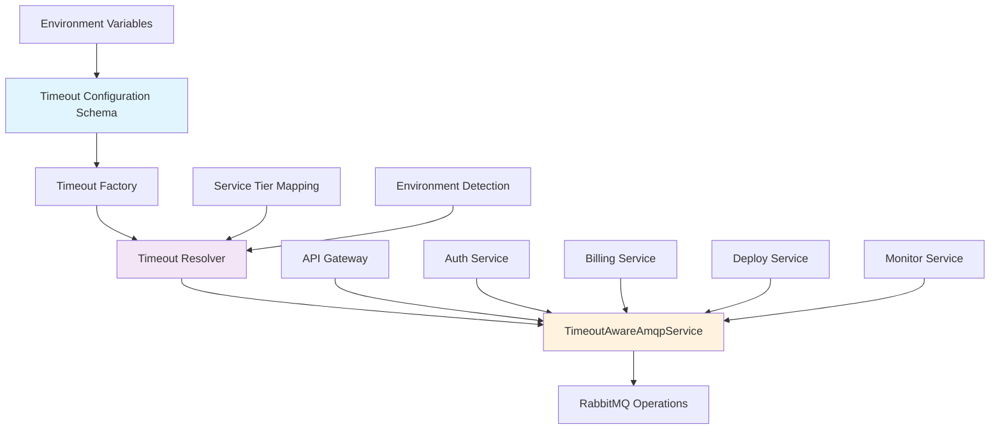

# Timeout System Architecture

## Overview

The Capsule Platform implements a comprehensive configurable timeout system for all inter-service communication via RabbitMQ. This system provides intelligent timeout resolution based on service types, operation criticality, and environment-specific scaling.

## Architecture Components



## Core Components

### 1. Timeout Configuration Schema (`timeout.schema.ts`)

Defines all configurable timeout parameters with validation:

- **Default timeouts**: Fallback values for all operations
- **Service tier timeouts**: Critical, standard, non-critical classifications
- **Service-specific timeouts**: Fine-tuned timeouts per service
- **Infrastructure timeouts**: Database, HTTP, health checks
- **Environment scaling**: Production vs development multipliers

### 2. Service Tier System

#### Critical Services (Fast Failure)

- **Default**: 2000ms
- **Services**: Auth Service
- **Purpose**: Prevent cascade failures in authentication

#### Standard Services (Balanced)

- **Default**: 5000ms
- **Services**: Billing Service, Deploy Service
- **Purpose**: Normal business operations

#### Non-Critical Services (Tolerant)

- **Default**: 10000ms
- **Services**: Monitor Service
- **Purpose**: Background operations that can tolerate delays

### 3. Timeout Resolver (`timeout.utils.ts`)

Intelligent timeout resolution algorithm:

```typescript
function resolveTimeout(serviceName, operation) {
  // 1. Try service-specific timeout
  if (hasSpecificTimeout(serviceName)) {
    return applyScaling(getSpecificTimeout(serviceName));
  }

  // 2. Fall back to service tier timeout
  const tier = getServiceTier(serviceName);
  const tierTimeout = getTierTimeout(tier);

  // 3. Apply environment scaling
  return applyScaling(tierTimeout);
}
```

### 4. TimeoutAwareAmqpService

Wraps `AmqpConnection` with intelligent timeout resolution:

- **Automatic timeout resolution** based on service name and operation
- **Comprehensive logging** of timeout decisions and performance
- **Error context** with timeout information
- **Debug capabilities** for troubleshooting

## Service Mapping Configuration

```typescript
const SERVICE_TIMEOUT_MAPPING = {
  'auth-service': {
    tier: ServiceTier.CRITICAL,
    specific: 'AUTH_SERVICE_TIMEOUT',
    healthCheck: 'HEALTH_CHECK_TIMEOUT',
  },
  'billing-service': {
    tier: ServiceTier.STANDARD,
    specific: 'BILLING_SERVICE_TIMEOUT',
    healthCheck: 'HEALTH_CHECK_TIMEOUT',
  },
  'deploy-service': {
    tier: ServiceTier.STANDARD,
    specific: 'DEPLOY_SERVICE_TIMEOUT',
    healthCheck: 'HEALTH_CHECK_TIMEOUT',
  },
  'monitor-service': {
    tier: ServiceTier.NON_CRITICAL,
    specific: 'MONITOR_SERVICE_TIMEOUT',
    healthCheck: 'HEALTH_CHECK_TIMEOUT',
  },
};
```

## Environment-Based Scaling

### Scaling Factors by Environment

| Environment     | Scale Factor        | Rationale                         |
| --------------- | ------------------- | --------------------------------- |
| **Test**        | 0.5x                | Fast test execution               |
| **Development** | 0.8x (configurable) | Quick feedback during development |
| **Local**       | 0.8x (configurable) | Local development environment     |
| **Staging**     | 1.5x (configurable) | Production-like but more tolerant |
| **Production**  | 1.5x (configurable) | Network delays and load tolerance |
| **Canary**      | 1.5x (configurable) | Production environment variant    |

### Scaling Logic

```typescript
function getScaleFactor(environment: AppEnvironment): number {
  switch (environment) {
    case AppEnvironment.PRODUCTION:
    case AppEnvironment.STAGING:
    case AppEnvironment.CANARY:
      return config.PRODUCTION_TIMEOUT_SCALE_FACTOR;
    case AppEnvironment.DEVELOPMENT:
    case AppEnvironment.LOCAL:
      return config.DEVELOPMENT_TIMEOUT_SCALE_FACTOR;
    case AppEnvironment.TEST:
      return 0.5; // Fixed 50% reduction for tests
    default:
      return 1.0;
  }
}
```

## Default Timeout Values

### Service-Specific Timeouts

| Service             | Default Timeout | Tier         | Rationale                       |
| ------------------- | --------------- | ------------ | ------------------------------- |
| **Auth Service**    | 2000ms          | Critical     | Authentication is critical path |
| **Billing Service** | 8000ms          | Standard     | Payment processing needs time   |
| **Deploy Service**  | 15000ms         | Standard     | Deployment operations are slow  |
| **Monitor Service** | 10000ms         | Non-Critical | Monitoring can tolerate delays  |

### Infrastructure Timeouts

| Operation              | Default Timeout | Rationale                         |
| ---------------------- | --------------- | --------------------------------- |
| **RabbitMQ Default**   | 5000ms          | General RPC operations            |
| **Health Check**       | 3000ms          | Quick health verification         |
| **Database Operation** | 10000ms         | Database queries and transactions |
| **HTTP Request**       | 30000ms         | External API calls                |

## Integration Patterns

### API Gateway Pattern

```typescript
@Injectable()
export class ApiGatewayService {
  constructor(private amqpService: TimeoutAwareAmqpService) {}

  async authenticateUser(credentials: LoginDto) {
    // Automatically uses AUTH_SERVICE_TIMEOUT with environment scaling
    return this.amqpService.request({
      exchange: 'capsule.commands',
      routingKey: 'auth.login',
      payload: credentials,
      serviceName: 'auth-service', // Critical tier, 2s base timeout
    });
  }

  async processPayment(payment: PaymentDto) {
    // Automatically uses BILLING_SERVICE_TIMEOUT
    return this.amqpService.request({
      exchange: 'capsule.commands',
      routingKey: 'billing.charge',
      payload: payment,
      serviceName: 'billing-service', // Standard tier, 8s base timeout
    });
  }
}
```

### Health Check Pattern

```typescript
async checkServicesHealth() {
  const services = ['auth-service', 'billing-service', 'deploy-service'];

  return Promise.allSettled(
    services.map(service =>
      this.amqpService.healthCheck(service, `${service.split('-')[0]}.health`)
    )
  );
}
```

### Event Publishing Pattern

```typescript
async publishEvent(eventData: EventDto) {
  // No timeout needed for fire-and-forget events
  await this.amqpService.publish({
    exchange: 'capsule.events',
    routingKey: 'user.created',
    payload: eventData,
    serviceName: 'auth-service',
  });
}
```

## Error Handling and Observability

### Timeout Error Context

```typescript
{
  "error": "Request timeout",
  "serviceName": "billing-service",
  "timeout": 12000,
  "actualDuration": 12001,
  "timedOut": true,
  "operation": "rpc_call",
  "tier": "standard",
  "source": "specific",
  "scaled": true,
  "scaleFactor": 1.5,
  "originalTimeout": 8000
}
```

### Debug Endpoint Response

```json
{
  "environment": "production",
  "scalingEnabled": true,
  "scaleFactor": 1.5,
  "services": {
    "auth-service": {
      "rpc": {
        "timeout": 3000,
        "source": "specific",
        "tier": "critical",
        "scaled": true,
        "scaleFactor": 1.5,
        "originalTimeout": 2000
      },
      "healthCheck": {
        "timeout": 4500,
        "source": "specific",
        "tier": "critical"
      }
    }
  },
  "defaults": {
    "rabbitmq": 7500,
    "healthCheck": 4500,
    "database": 15000,
    "http": 45000
  }
}
```

## Performance Characteristics

### Timeout Resolution Performance

- **Timeout calculation**: O(1) constant time lookup
- **Service tier mapping**: O(1) hash table lookup
- **Environment scaling**: O(1) arithmetic operation
- **Memory overhead**: Minimal configuration caching

### Network Performance Impact

- **Reduced cascade failures**: Fast timeout for critical services
- **Improved error reporting**: Detailed timeout context
- **Better resource utilization**: Appropriate timeouts per service type

## Configuration Best Practices

### Environment-Specific Configuration

```bash
# Development - Fast feedback
DEVELOPMENT_TIMEOUT_SCALE_FACTOR=0.7
AUTH_SERVICE_TIMEOUT=1500
BILLING_SERVICE_TIMEOUT=5000

# Production - Network tolerance
PRODUCTION_TIMEOUT_SCALE_FACTOR=2.0
AUTH_SERVICE_TIMEOUT=3000
BILLING_SERVICE_TIMEOUT=15000
DATABASE_OPERATION_TIMEOUT=20000
```

### Service-Specific Tuning

1. **Critical Services**: Keep timeouts short (1-3 seconds)
2. **Payment Services**: Allow for processing time (5-15 seconds)
3. **Deployment Services**: Account for container startup (10-30 seconds)
4. **Background Services**: More tolerant timeouts (5-30 seconds)

### Monitoring and Alerting

1. **Track timeout rates** per service and operation
2. **Alert on high timeout rates** (>5% for critical services)
3. **Monitor timeout distribution** to identify bottlenecks
4. **Use debug endpoint** to verify configuration

## Extensibility

### Adding New Services

1. **Add to service mapping**:

   ```typescript
   'new-service': {
     tier: ServiceTier.STANDARD,
     specific: 'NEW_SERVICE_TIMEOUT',
     healthCheck: 'HEALTH_CHECK_TIMEOUT',
   }
   ```

2. **Add environment variable**:

   ```bash
   NEW_SERVICE_TIMEOUT=7000
   ```

3. **Update schema**:
   ```typescript
   NEW_SERVICE_TIMEOUT: z.number().default(7000);
   ```

### Custom Timeout Logic

```typescript
class CustomTimeoutResolver extends TimeoutResolver {
  resolveTimeout(serviceName: string, operation: TimeoutOperation) {
    // Custom business logic
    if (serviceName === 'special-service' && isHighLoadTime()) {
      return { timeout: 30000, source: 'custom' };
    }
    return super.resolveTimeout(serviceName, operation);
  }
}
```

## Security Considerations

- **Timeout values are not sensitive** but can reveal service architecture
- **Debug endpoints should be restricted** in production environments
- **Reasonable maximum timeouts** prevent resource exhaustion
- **Minimum timeout enforcement** prevents infinite waits

## Future Enhancements

1. **Dynamic timeout adjustment** based on service health metrics
2. **Circuit breaker integration** for services with high timeout rates
3. **Per-user timeout policies** for different service tiers
4. **Timeout analytics dashboard** for operational insights
5. **Machine learning-based timeout optimization** based on historical data

This architecture provides a solid foundation for scalable, maintainable timeout management across the entire microservices platform.
